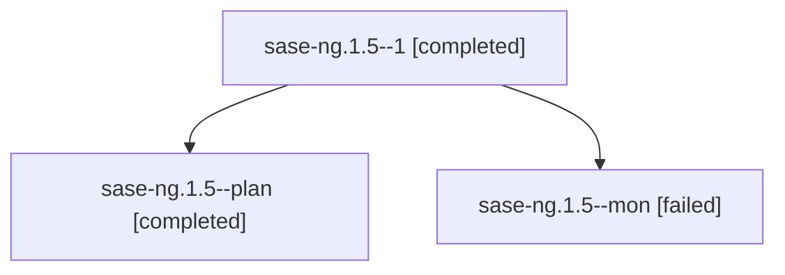

# Family: sase-ng.1.5

[Agent Hoods](../README.md) / [bbugyi200](../users/bbugyi200/README.md) / [athena](../users/bbugyi200/machines/athena/README.md) / [sase-ng](../users/bbugyi200/machines/athena/hoods/sase-ng/README.md) / sase-ng.1.5

Owner: `bbugyi200.athena` · Hood: `sase-ng` · Members: 3 · Bead: [sase-ng.1.5](https://github.com/sase-org/sase--beads/blob/main/pages/sase-ng/sase-ng.1.5.md)

## Lineage

The diagram is an optional enhancement; the ordered table below contains the same lineage in accessible text.

| Role | Agent | State | Model / provider | Timing | Commits | Prompt | Chat |
|---|---|---|---|---|---:|---|---|
| 1 | sase-ng.1.5--1 | completed | sonnet / claude | 2026-08-17T21:47:29.222954+00:00 | [1](../agents/bbugyi200.athena.sase-ng.1.5--1/README.md#commits) | [Prompt](../agents/bbugyi200.athena.sase-ng.1.5--1/prompt.md) | [Chat](../agents/bbugyi200.athena.sase-ng.1.5--1/chat.md) |
| plan | sase-ng.1.5--plan | completed | sonnet / claude | 2026-08-17T21:08:31.028172+00:00 | 0 | [Prompt](../agents/bbugyi200.athena.sase-ng.1.5--plan/prompt.md) | [Chat](../agents/bbugyi200.athena.sase-ng.1.5--plan/chat.md) |
| mon | sase-ng.1.5--mon | failed | sonnet / claude | 2026-08-17T21:33:43.124206+00:00 | 0 | — | [Chat](../agents/bbugyi200.athena.sase-ng.1.5--mon/chat.md) |

## Commits

| Role | Repo | Commit | Subject | Committed |
|---|---|---|---|---|
| 1 | sase | [`65b72d4`](https://github.com/sase-org/sase/commit/65b72d43afc9c84ed313c77592744aa3de8c86ec) | refactor(tui): retire launch-body support modules orphaned by the deletion | 2026-08-17 17:51:57 EDT |

## Neighbors

| Agent | Relation | State |
|---|---|---|
| [sase-ng](bbugyi200.athena.sase-ng.md) (family · 2) | ancestor | failed 2 |
| [sase-ng.1.1](bbugyi200.athena.sase-ng.1.1.md) (family · 3) | sase-ng.1 hood | completed 2, failed 1 |
| [sase-ng.1.2](../agents/bbugyi200.athena.sase-ng.1.2/README.md) | sase-ng.1 hood | completed |
| [sase-ng.1.3](../agents/bbugyi200.athena.sase-ng.1.3/README.md) | sase-ng.1 hood | completed |
| [sase-ng.1.4](../agents/bbugyi200.athena.sase-ng.1.4/README.md) | sase-ng.1 hood | completed |
| [sase-ng.1.6](bbugyi200.athena.sase-ng.1.6.md) (family · 3) | sase-ng.1 hood | completed 2, failed 1 |
| [sase-ng.1.land](bbugyi200.athena.sase-ng.1.land.md) (family · 3) | sase-ng.1 hood | completed 2, failed 1 |
