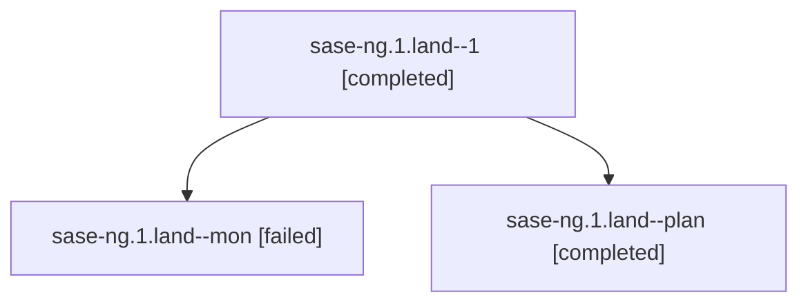

# Family: sase-ng.1.land

[Agent Hoods](../README.md) / [bbugyi200](../users/bbugyi200/README.md) / [athena](../users/bbugyi200/machines/athena/README.md) / [sase-ng](../users/bbugyi200/machines/athena/hoods/sase-ng/README.md) / sase-ng.1.land

Owner: `bbugyi200.athena` · Hood: `sase-ng` · Members: 3 · Bead: [sase-ng.1](https://github.com/sase-org/sase--beads/blob/main/pages/sase-ng/sase-ng.1.md)

## Lineage

The diagram is an optional enhancement; the ordered table below contains the same lineage in accessible text.

| Role | Agent | State | Model / provider | Timing | Commits | Prompt | Chat |
|---|---|---|---|---|---:|---|---|
| 1 | sase-ng.1.land--1 | completed | opus / claude | 2026-08-17T23:25:23.987548+00:00 | [1](../agents/bbugyi200.athena.sase-ng.1.land--1/README.md#commits) | [Prompt](../agents/bbugyi200.athena.sase-ng.1.land--1/prompt.md) | [Chat](../agents/bbugyi200.athena.sase-ng.1.land--1/chat.md) |
| mon | sase-ng.1.land--mon | failed | opus / claude | 2026-08-17T23:01:59.371271+00:00 | 0 | — | [Chat](../agents/bbugyi200.athena.sase-ng.1.land--mon/chat.md) |
| plan | sase-ng.1.land--plan | completed | opus / claude | 2026-08-17T22:43:24.485726+00:00 | 0 | [Prompt](../agents/bbugyi200.athena.sase-ng.1.land--plan/prompt.md) | [Chat](../agents/bbugyi200.athena.sase-ng.1.land--plan/chat.md) |

## Commits

| Role | Repo | Commit | Subject | Committed |
|---|---|---|---|---|
| 1 | sase | [`f77d940`](https://github.com/sase-org/sase/commit/f77d940d6ca0767966c6b377f8924f72c1d13e68) | test(flake-baseline): retire pre-fix force-reuse seam evidence | 2026-08-17 23:56:11 UTC |

## Neighbors

| Agent | Relation | State |
|---|---|---|
| [sase-ng](bbugyi200.athena.sase-ng.md) (family · 2) | ancestor | failed 2 |
| [sase-ng.1.1](bbugyi200.athena.sase-ng.1.1.md) (family · 3) | sase-ng.1 hood | completed 2, failed 1 |
| [sase-ng.1.2](../agents/bbugyi200.athena.sase-ng.1.2/README.md) | sase-ng.1 hood | completed |
| [sase-ng.1.3](../agents/bbugyi200.athena.sase-ng.1.3/README.md) | sase-ng.1 hood | completed |
| [sase-ng.1.4](../agents/bbugyi200.athena.sase-ng.1.4/README.md) | sase-ng.1 hood | completed |
| [sase-ng.1.5](bbugyi200.athena.sase-ng.1.5.md) (family · 3) | sase-ng.1 hood | completed 2, failed 1 |
| [sase-ng.1.6](bbugyi200.athena.sase-ng.1.6.md) (family · 3) | sase-ng.1 hood | completed 2, failed 1 |
