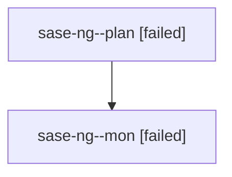

# Family: sase-ng

[Agent Hoods](../README.md) / [bbugyi200](../users/bbugyi200/README.md) / [athena](../users/bbugyi200/machines/athena/README.md) / [sase-ng](../users/bbugyi200/machines/athena/hoods/sase-ng/README.md) / sase-ng

Owner: `bbugyi200.athena` · Hood: `sase-ng` · Members: 2 · Bead: [sase-ng](https://github.com/sase-org/sase--beads/blob/main/pages/sase-ng/README.md)

## Lineage

The diagram is an optional enhancement; the ordered table below contains the same lineage in accessible text.

| Role | Agent | State | Model / provider | Timing | Commits | Prompt | Chat |
|---|---|---|---|---|---:|---|---|
| plan | sase-ng--plan | failed | opus / claude | 2026-08-17T18:26:28.403516+00:00 | 0 | [Prompt](../agents/bbugyi200.athena.sase-ng--plan/prompt.md) | [Chat](../agents/bbugyi200.athena.sase-ng--plan/chat.md) |
| mon | sase-ng--mon | failed | opus / claude | 2026-08-17T19:16:45.713957+00:00 | 0 | — | [Chat](../agents/bbugyi200.athena.sase-ng--mon/chat.md) |

## Neighbors

| Agent | Relation | State |
|---|---|---|
| [sase-ng.1.1](bbugyi200.athena.sase-ng.1.1.md) (family · 3) | descendant | completed 2, failed 1 |
| [sase-ng.1.2](../agents/bbugyi200.athena.sase-ng.1.2/README.md) | descendant | completed |
| [sase-ng.1.3](../agents/bbugyi200.athena.sase-ng.1.3/README.md) | descendant | completed |
| [sase-ng.1.4](../agents/bbugyi200.athena.sase-ng.1.4/README.md) | descendant | completed |
| [sase-ng.1.5](bbugyi200.athena.sase-ng.1.5.md) (family · 3) | descendant | completed 2, failed 1 |
| [sase-ng.1.6](bbugyi200.athena.sase-ng.1.6.md) (family · 3) | descendant | completed 2, failed 1 |
| [sase-ng.1.land](bbugyi200.athena.sase-ng.1.land.md) (family · 3) | descendant | completed 2, failed 1 |
