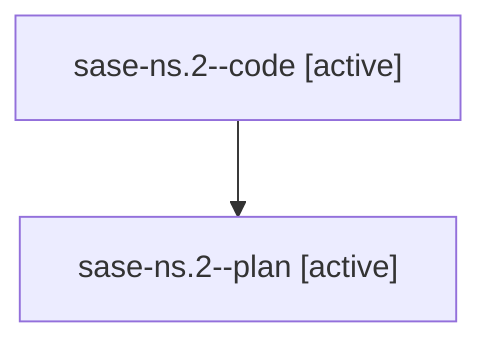

# Family: sase-ns.2

[Agent Hoods](../README.md) / [bbugyi200](../users/bbugyi200/README.md) / [athena](../users/bbugyi200/machines/athena/README.md) / [sase-ns](../users/bbugyi200/machines/athena/hoods/sase-ns/README.md) / sase-ns.2

Owner: `bbugyi200.athena` · Hood: `sase-ns` · Members: 2 · Bead: [sase-ns.2](https://github.com/sase-org/sase--beads/blob/main/pages/sase-ns/sase-ns.2.md)

## Lineage

The diagram is an optional enhancement; the ordered table below contains the same lineage in accessible text.

| Role | Agent | State | Model / provider | Timing | Commits | Prompt | Chat |
|---|---|---|---|---|---:|---|---|
| code | sase-ns.2--code | active | grok-4.6 / grok | 2026-08-16T21:19:32.955098+00:00 | 0 | — | — |
| plan | sase-ns.2--plan | active | gpt-5.6-sol / codex | 2026-08-16T21:15:46.012890+00:00 | 0 | [Prompt](../agents/bbugyi200.athena.sase-ns.2--plan/prompt.md) | [Chat](../agents/bbugyi200.athena.sase-ns.2--plan/chat.md) |

## Neighbors

| Agent | Relation | State |
|---|---|---|
| [sase-ns.1](bbugyi200.athena.sase-ns.1.md) (family · 2) | sase-ns hood | active 2 |
| [sase-ns.3](bbugyi200.athena.sase-ns.3.md) (family · 2) | sase-ns hood | active 2 |
| [sase-ns.4](../agents/bbugyi200.athena.sase-ns.4/README.md) | sase-ns hood | active |
| [sase-ns.5](../agents/bbugyi200.athena.sase-ns.5/README.md) | sase-ns hood | active |
| [sase-ns.land](../agents/bbugyi200.athena.sase-ns.land/README.md) | sase-ns hood | waiting |
