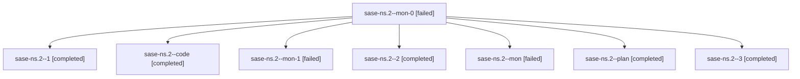

# Family: sase-ns.2

[Agent Hoods](../README.md) / [bbugyi200](../users/bbugyi200/README.md) / [athena](../users/bbugyi200/machines/athena/README.md) / [sase-ns](../users/bbugyi200/machines/athena/hoods/sase-ns/README.md) / sase-ns.2

Owner: `bbugyi200.athena` · Hood: `sase-ns` · Members: 8 · Bead: [sase-ns.2](https://github.com/sase-org/sase--beads/blob/main/pages/sase-ns/sase-ns.2.md)

## Lineage

The diagram is an optional enhancement; the ordered table below contains the same lineage in accessible text.

| Role | Agent | State | Model / provider | Timing | Commits | Prompt | Chat |
|---|---|---|---|---|---:|---|---|
| mon-0 | sase-ns.2--mon-0 | failed | grok-4.6 / grok | 2026-08-16T22:09:30.827443+00:00 | 0 | — | [Chat](../agents/bbugyi200.athena.sase-ns.2--mon-0/chat.md) |
| 1 | sase-ns.2--1 | completed | grok-4.6 / grok | 2026-08-16T21:57:19.144715+00:00 | 0 | [Prompt](../agents/bbugyi200.athena.sase-ns.2--1/prompt.md) | [Chat](../agents/bbugyi200.athena.sase-ns.2--1/chat.md) |
| code | sase-ns.2--code | completed | grok-4.6 / grok | 2026-08-16T21:19:32.955098+00:00 | 0 | — | [Chat](../agents/bbugyi200.athena.sase-ns.2--code/chat.md) |
| mon-1 | sase-ns.2--mon-1 | failed | grok-4.6 / grok | 2026-08-16T22:36:17.436106+00:00 | 0 | — | [Chat](../agents/bbugyi200.athena.sase-ns.2--mon-1/chat.md) |
| 2 | sase-ns.2--2 | completed | grok-4.6 / grok | 2026-08-16T22:21:52.741976+00:00 | 0 | [Prompt](../agents/bbugyi200.athena.sase-ns.2--2/prompt.md) | [Chat](../agents/bbugyi200.athena.sase-ns.2--2/chat.md) |
| mon | sase-ns.2--mon | failed | grok-4.6 / grok | 2026-08-16T21:56:49.164603+00:00 | 0 | — | [Chat](../agents/bbugyi200.athena.sase-ns.2--mon/chat.md) |
| plan | sase-ns.2--plan | completed | gpt-5.6-sol / codex | 2026-08-16T21:15:46.012890+00:00 | 0 | [Prompt](../agents/bbugyi200.athena.sase-ns.2--plan/prompt.md) | [Chat](../agents/bbugyi200.athena.sase-ns.2--plan/chat.md) |
| 3 | sase-ns.2--3 | completed | grok-4.6 / grok | 2026-08-16T22:51:48.616926+00:00 | [1](../agents/bbugyi200.athena.sase-ns.2--3/README.md#commits) | [Prompt](../agents/bbugyi200.athena.sase-ns.2--3/prompt.md) | [Chat](../agents/bbugyi200.athena.sase-ns.2--3/chat.md) |

## Commits

| Role | Repo | Commit | Subject | Committed |
|---|---|---|---|---|
| 3 | sase | [`3a22ff0`](https://github.com/sase-org/sase/commit/3a22ff04f67a78af9416c87b1f6b591903c30962) | fix(config): isolate config cache from test-owned CONFIG\_DIR | 2026-08-16 19:02:36 EDT |

## Neighbors

| Agent | Relation | State |
|---|---|---|
| [sase-ns.1](bbugyi200.athena.sase-ns.1.md) (family · 4) | sase-ns hood | completed 3, failed 1 |
| [sase-ns.3](bbugyi200.athena.sase-ns.3.md) (family · 2) | sase-ns hood | completed 2 |
| [sase-ns.4](../agents/bbugyi200.athena.sase-ns.4/README.md) | sase-ns hood | completed |
| [sase-ns.5](../agents/bbugyi200.athena.sase-ns.5/README.md) | sase-ns hood | completed |
| [sase-ns.6.1](bbugyi200.athena.sase-ns.6.1.md) (family · 2) | sase-ns hood | completed 2 |
| [sase-ns.6.2](bbugyi200.athena.sase-ns.6.2.md) (family · 2) | sase-ns hood | completed 2 |
| [sase-ns.6.3](../agents/bbugyi200.athena.sase-ns.6.3/README.md) | sase-ns hood | completed |
| [sase-ns.6.4](../agents/bbugyi200.athena.sase-ns.6.4/README.md) | sase-ns hood | completed |
| [sase-ns.6.5](../agents/bbugyi200.athena.sase-ns.6.5/README.md) | sase-ns hood | completed |
| [sase-ns.6.6.1](../agents/bbugyi200.athena.sase-ns.6.6.1/README.md) | sase-ns hood | completed |
| [sase-ns.6.6.2](../agents/bbugyi200.athena.sase-ns.6.6.2/README.md) | sase-ns hood | completed |
| [sase-ns.6.6.3](../agents/bbugyi200.athena.sase-ns.6.6.3/README.md) | sase-ns hood | completed |
| [sase-ns.6.6.4](bbugyi200.athena.sase-ns.6.6.4.md) (family · 4) | sase-ns hood | active 1, completed 2, failed 1 |
| [sase-ns.6.6.5](bbugyi200.athena.sase-ns.6.6.5.md) (family · 2) | sase-ns hood | active 2 |
| [sase-ns.6.6.land](../agents/bbugyi200.athena.sase-ns.6.6.land/README.md) | sase-ns hood | waiting |
| [sase-ns.6.land](bbugyi200.athena.sase-ns.6.land.md) (family · 4) | sase-ns hood | completed 1, failed 3 |
| [sase-ns.land](bbugyi200.athena.sase-ns.land.md) (family · 4) | sase-ns hood | completed 1, failed 3 |
