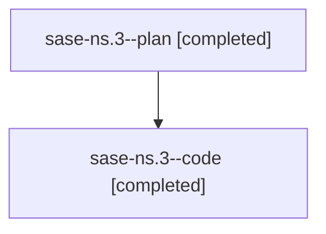

# Family: sase-ns.3

[Agent Hoods](../README.md) / [bbugyi200](../users/bbugyi200/README.md) / [athena](../users/bbugyi200/machines/athena/README.md) / [sase-ns](../users/bbugyi200/machines/athena/hoods/sase-ns/README.md) / sase-ns.3

Owner: `bbugyi200.athena` · Hood: `sase-ns` · Members: 2 · Bead: [sase-ns.3](https://github.com/sase-org/sase--beads/blob/main/pages/sase-ns/sase-ns.3.md)

## Lineage

The diagram is an optional enhancement; the ordered table below contains the same lineage in accessible text.

| Role | Agent | State | Model / provider | Timing | Commits | Prompt | Chat |
|---|---|---|---|---|---:|---|---|
| plan | sase-ns.3--plan | completed | opus / claude | 2026-08-16T21:15:54.215367+00:00 | 0 | [Prompt](../agents/bbugyi200.athena.sase-ns.3--plan/prompt.md) | [Chat](../agents/bbugyi200.athena.sase-ns.3--plan/chat.md) |
| code | sase-ns.3--code | completed | gpt-5.5 / codex | 2026-08-16T21:25:26.365391+00:00 | 0 | — | [Chat](../agents/bbugyi200.athena.sase-ns.3--code/chat.md) |

## Neighbors

| Agent | Relation | State |
|---|---|---|
| [sase-ns.1](bbugyi200.athena.sase-ns.1.md) (family · 4) | sase-ns hood | completed 3, failed 1 |
| [sase-ns.2](bbugyi200.athena.sase-ns.2.md) (family · 8) | sase-ns hood | completed 5, failed 3 |
| [sase-ns.4](../agents/bbugyi200.athena.sase-ns.4/README.md) | sase-ns hood | completed |
| [sase-ns.5](../agents/bbugyi200.athena.sase-ns.5/README.md) | sase-ns hood | completed |
| [sase-ns.6.1](bbugyi200.athena.sase-ns.6.1.md) (family · 2) | sase-ns hood | completed 2 |
| [sase-ns.6.2](bbugyi200.athena.sase-ns.6.2.md) (family · 2) | sase-ns hood | completed 2 |
| [sase-ns.6.3](../agents/bbugyi200.athena.sase-ns.6.3/README.md) | sase-ns hood | completed |
| [sase-ns.6.4](../agents/bbugyi200.athena.sase-ns.6.4/README.md) | sase-ns hood | completed |
| [sase-ns.6.5](../agents/bbugyi200.athena.sase-ns.6.5/README.md) | sase-ns hood | completed |
| [sase-ns.6.6.1](../agents/bbugyi200.athena.sase-ns.6.6.1/README.md) | sase-ns hood | completed |
| [sase-ns.6.6.2](../agents/bbugyi200.athena.sase-ns.6.6.2/README.md) | sase-ns hood | completed |
| [sase-ns.6.6.3](../agents/bbugyi200.athena.sase-ns.6.6.3/README.md) | sase-ns hood | completed |
| [sase-ns.6.6.4](bbugyi200.athena.sase-ns.6.6.4.md) (family · 4) | sase-ns hood | completed 3, failed 1 |
| [sase-ns.6.6.5](bbugyi200.athena.sase-ns.6.6.5.md) (family · 4) | sase-ns hood | completed 3, failed 1 |
| [sase-ns.6.6.6.1](bbugyi200.athena.sase-ns.6.6.6.1.md) (family · 4) | sase-ns hood | active 1, completed 2, failed 1 |
| [sase-ns.6.6.6.2](../agents/bbugyi200.athena.sase-ns.6.6.6.2/README.md) | sase-ns hood | completed |
| [sase-ns.6.6.6.3](bbugyi200.athena.sase-ns.6.6.6.3.md) (family · 2) | sase-ns hood | completed 2 |
| [sase-ns.6.6.6.4](../agents/bbugyi200.athena.sase-ns.6.6.6.4/README.md) | sase-ns hood | dismissed |
| [sase-ns.6.6.6.5](../agents/bbugyi200.athena.sase-ns.6.6.6.5/README.md) | sase-ns hood | completed |
| [sase-ns.6.6.6.land](../agents/bbugyi200.athena.sase-ns.6.6.6.land/README.md) | sase-ns hood | waiting |
| [sase-ns.6.6.land](bbugyi200.athena.sase-ns.6.6.land.md) (family · 4) | sase-ns hood | completed 1, failed 3 |
| [sase-ns.6.6.land](../agents/bbugyi200.athena.sase-ns.6.6.land/README.md) | sase-ns hood | completed |
| [sase-ns.6.land](bbugyi200.athena.sase-ns.6.land.md) (family · 4) | sase-ns hood | completed 1, failed 3 |
| [sase-ns.6.land](../agents/bbugyi200.athena.sase-ns.6.land/README.md) | sase-ns hood | completed |
| [sase-ns.land](bbugyi200.athena.sase-ns.land.md) (family · 4) | sase-ns hood | completed 1, failed 3 |
| [sase-ns.land](../agents/bbugyi200.athena.sase-ns.land/README.md) | sase-ns hood | completed |
