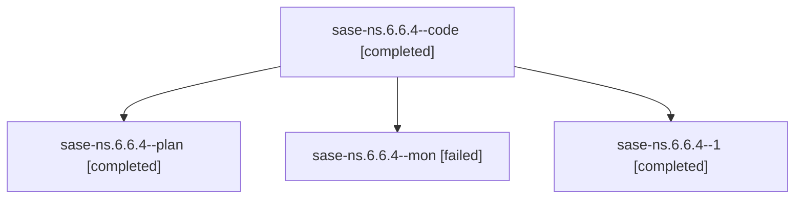

# Family: sase-ns.6.6.4

[Agent Hoods](../README.md) / [bbugyi200](../users/bbugyi200/README.md) / [athena](../users/bbugyi200/machines/athena/README.md) / [sase-ns](../users/bbugyi200/machines/athena/hoods/sase-ns/README.md) / sase-ns.6.6.4

Owner: `bbugyi200.athena` · Hood: `sase-ns` · Members: 4 · Bead: [sase-ns.6.6.4](https://github.com/sase-org/sase--beads/blob/main/pages/sase-ns/sase-ns.6.6.4.md)

## Lineage

The diagram is an optional enhancement; the ordered table below contains the same lineage in accessible text.

| Role | Agent | State | Model / provider | Timing | Commits | Prompt | Chat |
|---|---|---|---|---|---:|---|---|
| code | sase-ns.6.6.4--code | completed | gpt-5.5 / codex | 2026-08-17T08:22:46.919509+00:00 | [1](../agents/bbugyi200.athena.sase-ns.6.6.4--code/README.md#commits) | — | [Chat](../agents/bbugyi200.athena.sase-ns.6.6.4--code/chat.md) |
| plan | sase-ns.6.6.4--plan | completed | gpt-5.6-sol / codex | 2026-08-17T08:17:53.230245+00:00 | 0 | [Prompt](../agents/bbugyi200.athena.sase-ns.6.6.4--plan/prompt.md) | [Chat](../agents/bbugyi200.athena.sase-ns.6.6.4--plan/chat.md) |
| mon | sase-ns.6.6.4--mon | failed | gpt-5.5 / codex | 2026-08-17T08:39:03.112849+00:00 | 0 | — | [Chat](../agents/bbugyi200.athena.sase-ns.6.6.4--mon/chat.md) |
| 1 | sase-ns.6.6.4--1 | completed | gpt-5.5 / codex | 2026-08-17T08:52:49.646691+00:00 | 0 | [Prompt](../agents/bbugyi200.athena.sase-ns.6.6.4--1/prompt.md) | [Chat](../agents/bbugyi200.athena.sase-ns.6.6.4--1/chat.md) |

## Commits

| Role | Repo | Commit | Subject | Committed |
|---|---|---|---|---|
| code | sase | [`f9ab15d`](https://github.com/sase-org/sase/commit/f9ab15d9c2a271d0db6f922885803ee257299771) | test(monitor): deflake idle timeout liveness bound | 2026-08-17 04:41:25 EDT |

## Neighbors

| Agent | Relation | State |
|---|---|---|
| [sase-ns.6.6.1](../agents/bbugyi200.athena.sase-ns.6.6.1/README.md) | sase-ns.6.6 hood | completed |
| [sase-ns.6.6.2](../agents/bbugyi200.athena.sase-ns.6.6.2/README.md) | sase-ns.6.6 hood | completed |
| [sase-ns.6.6.3](../agents/bbugyi200.athena.sase-ns.6.6.3/README.md) | sase-ns.6.6 hood | completed |
| [sase-ns.6.6.5](bbugyi200.athena.sase-ns.6.6.5.md) (family · 4) | sase-ns.6.6 hood | completed 3, failed 1 |
| [sase-ns.6.6.land](../agents/bbugyi200.athena.sase-ns.6.6.land/README.md) | sase-ns.6.6 hood | active |
| [sase-ns.6.1](bbugyi200.athena.sase-ns.6.1.md) (family · 2) | sase-ns.6 hood | completed 2 |
| [sase-ns.6.2](bbugyi200.athena.sase-ns.6.2.md) (family · 2) | sase-ns.6 hood | completed 2 |
| [sase-ns.6.3](../agents/bbugyi200.athena.sase-ns.6.3/README.md) | sase-ns.6 hood | completed |
| [sase-ns.6.4](../agents/bbugyi200.athena.sase-ns.6.4/README.md) | sase-ns.6 hood | completed |
| [sase-ns.6.5](../agents/bbugyi200.athena.sase-ns.6.5/README.md) | sase-ns.6 hood | completed |
| [sase-ns.6.land](bbugyi200.athena.sase-ns.6.land.md) (family · 4) | sase-ns.6 hood | completed 1, failed 3 |
| [sase-ns.1](bbugyi200.athena.sase-ns.1.md) (family · 4) | sase-ns hood | completed 3, failed 1 |
| [sase-ns.2](bbugyi200.athena.sase-ns.2.md) (family · 8) | sase-ns hood | completed 5, failed 3 |
| [sase-ns.3](bbugyi200.athena.sase-ns.3.md) (family · 2) | sase-ns hood | completed 2 |
| [sase-ns.4](../agents/bbugyi200.athena.sase-ns.4/README.md) | sase-ns hood | completed |
| [sase-ns.5](../agents/bbugyi200.athena.sase-ns.5/README.md) | sase-ns hood | completed |
| [sase-ns.land](bbugyi200.athena.sase-ns.land.md) (family · 4) | sase-ns hood | completed 1, failed 3 |
