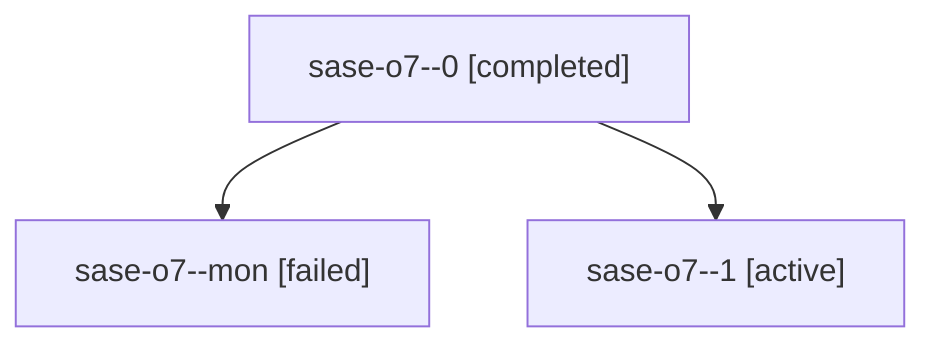

# Family: sase-o7

[Agent Hoods](../README.md) / [bbugyi200](../users/bbugyi200/README.md) / [athena](../users/bbugyi200/machines/athena/README.md) / [sase-o7](../users/bbugyi200/machines/athena/hoods/sase-o7/README.md) / sase-o7

Owner: `bbugyi200.athena` · Hood: `sase-o7` · Members: 3 · Bead: [sase-o7](https://github.com/sase-org/sase--beads/blob/main/pages/sase-o7/README.md)

## Lineage

The diagram is an optional enhancement; the ordered table below contains the same lineage in accessible text.

| Role | Agent | State | Model / provider | Timing | Commits | Prompt | Chat |
|---|---|---|---|---|---:|---|---|
| 0 | sase-o7--0 | completed | grok-4.6 / grok | 2026-08-17T12:54:12.267140+00:00 | 0 | [Prompt](../agents/bbugyi200.athena.sase-o7--0/prompt.md) | [Chat](../agents/bbugyi200.athena.sase-o7--0/chat.md) |
| mon | sase-o7--mon | failed | grok-4.6 / grok | 2026-08-17T13:31:34.541200+00:00 | 0 | — | [Chat](../agents/bbugyi200.athena.sase-o7--mon/chat.md) |
| 1 | sase-o7--1 | active | grok-4.6 / grok | 2026-08-17T13:49:46.494055+00:00 | 0 | [Prompt](../agents/bbugyi200.athena.sase-o7--1/prompt.md) | — |
