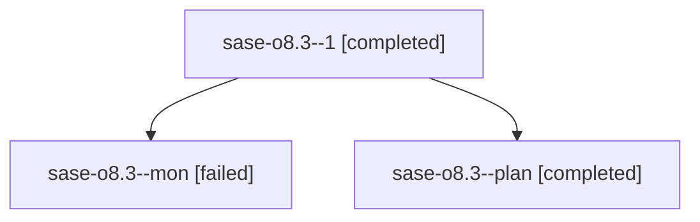

# Family: sase-o8.3

[Agent Hoods](../README.md) / [bbugyi200](../users/bbugyi200/README.md) / [athena](../users/bbugyi200/machines/athena/README.md) / [sase-o8](../users/bbugyi200/machines/athena/hoods/sase-o8/README.md) / sase-o8.3

Owner: `bbugyi200.athena` · Hood: `sase-o8` · Members: 3 · Bead: [sase-o8.3](https://github.com/sase-org/sase--beads/blob/main/pages/sase-o8/sase-o8.3.md)

## Lineage

The diagram is an optional enhancement; the ordered table below contains the same lineage in accessible text.

| Role | Agent | State | Model / provider | Timing | Commits | Prompt | Chat |
|---|---|---|---|---|---:|---|---|
| 1 | sase-o8.3--1 | completed | grok-4.6 / grok | 2026-08-17T11:42:02.447164+00:00 | 0 | [Prompt](../agents/bbugyi200.athena.sase-o8.3--1/prompt.md) | [Chat](../agents/bbugyi200.athena.sase-o8.3--1/chat.md) |
| mon | sase-o8.3--mon | failed | grok-4.6 / grok | 2026-08-17T11:25:03.196541+00:00 | 0 | — | [Chat](../agents/bbugyi200.athena.sase-o8.3--mon/chat.md) |
| plan | sase-o8.3--plan | completed | grok-4.6 / grok | 2026-08-17T11:03:34.303292+00:00 | 0 | [Prompt](../agents/bbugyi200.athena.sase-o8.3--plan/prompt.md) | [Chat](../agents/bbugyi200.athena.sase-o8.3--plan/chat.md) |

## Commits

| Role | Repo | Commit | Subject | Committed |
|---|---|---|---|---|
| — | sase | [`577986a`](https://github.com/sase-org/sase/commit/577986af5e33db57346e8c622845ed14e7c03b03) | feat(history): rank common placeholders by relation, recency, and frequency | 2026-08-17 11:46:19 UTC |

## Neighbors

| Agent | Relation | State |
|---|---|---|
| [sase-o8.1](../agents/bbugyi200.athena.sase-o8.1/README.md) | sase-o8 hood | completed |
| [sase-o8.2](../agents/bbugyi200.athena.sase-o8.2/README.md) | sase-o8 hood | completed |
| [sase-o8.4](../agents/bbugyi200.athena.sase-o8.4/README.md) | sase-o8 hood | completed |
| [sase-o8.5](../agents/bbugyi200.athena.sase-o8.5/README.md) | sase-o8 hood | completed |
| [sase-o8.land](bbugyi200.athena.sase-o8.land.md) (family · 3) | sase-o8 hood | completed 2, failed 1 |
