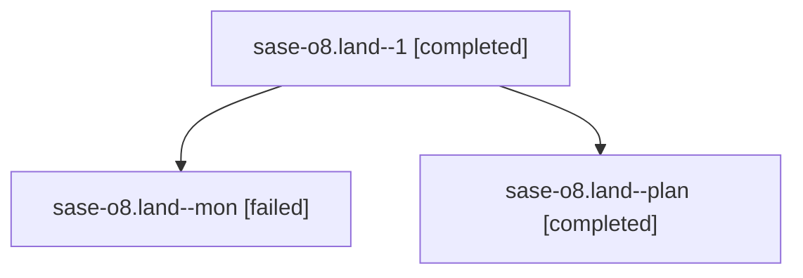

# Family: sase-o8.land

[Agent Hoods](../README.md) / [bbugyi200](../users/bbugyi200/README.md) / [athena](../users/bbugyi200/machines/athena/README.md) / [sase-o8](../users/bbugyi200/machines/athena/hoods/sase-o8/README.md) / sase-o8.land

Owner: `bbugyi200.athena` · Hood: `sase-o8` · Members: 3 · Bead: [sase-o8](https://github.com/sase-org/sase--beads/blob/main/pages/sase-o8/README.md)

## Lineage

The diagram is an optional enhancement; the ordered table below contains the same lineage in accessible text.

| Role | Agent | State | Model / provider | Timing | Commits | Prompt | Chat |
|---|---|---|---|---|---:|---|---|
| 1 | sase-o8.land--1 | completed | opus / claude | 2026-08-17T13:58:20.752631+00:00 | 0 | [Prompt](../agents/bbugyi200.athena.sase-o8.land--1/prompt.md) | [Chat](../agents/bbugyi200.athena.sase-o8.land--1/chat.md) |
| mon | sase-o8.land--mon | failed | opus / claude | 2026-08-17T13:38:15.417122+00:00 | 0 | — | [Chat](../agents/bbugyi200.athena.sase-o8.land--mon/chat.md) |
| plan | sase-o8.land--plan | completed | opus / claude | 2026-08-17T13:12:04.378232+00:00 | 0 | [Prompt](../agents/bbugyi200.athena.sase-o8.land--plan/prompt.md) | [Chat](../agents/bbugyi200.athena.sase-o8.land--plan/chat.md) |

## Neighbors

| Agent | Relation | State |
|---|---|---|
| [sase-o8.1](../agents/bbugyi200.athena.sase-o8.1/README.md) | sase-o8 hood | completed |
| [sase-o8.2](../agents/bbugyi200.athena.sase-o8.2/README.md) | sase-o8 hood | completed |
| [sase-o8.3](bbugyi200.athena.sase-o8.3.md) (family · 3) | sase-o8 hood | completed 2, failed 1 |
| [sase-o8.4](../agents/bbugyi200.athena.sase-o8.4/README.md) | sase-o8 hood | completed |
| [sase-o8.5](../agents/bbugyi200.athena.sase-o8.5/README.md) | sase-o8 hood | completed |
