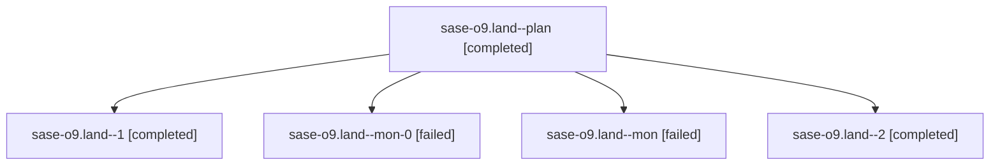

# Family: sase-o9.land

[Agent Hoods](../README.md) / [bbugyi200](../users/bbugyi200/README.md) / [athena](../users/bbugyi200/machines/athena/README.md) / [sase-o9](../users/bbugyi200/machines/athena/hoods/sase-o9/README.md) / sase-o9.land

Owner: `bbugyi200.athena` · Hood: `sase-o9` · Members: 5 · Bead: [sase-o9](https://github.com/sase-org/sase--beads/blob/main/pages/sase-o9/README.md)

## Lineage

The diagram is an optional enhancement; the ordered table below contains the same lineage in accessible text.

| Role | Agent | State | Model / provider | Timing | Commits | Prompt | Chat |
|---|---|---|---|---|---:|---|---|
| plan | sase-o9.land--plan | completed | opus / claude | 2026-08-17T13:03:10.194757+00:00 | 0 | [Prompt](../agents/bbugyi200.athena.sase-o9.land--plan/prompt.md) | [Chat](../agents/bbugyi200.athena.sase-o9.land--plan/chat.md) |
| 1 | sase-o9.land--1 | completed | opus / claude | 2026-08-17T13:40:40.296283+00:00 | 0 | [Prompt](../agents/bbugyi200.athena.sase-o9.land--1/prompt.md) | [Chat](../agents/bbugyi200.athena.sase-o9.land--1/chat.md) |
| mon-0 | sase-o9.land--mon-0 | failed | opus / claude | 2026-08-17T14:32:50.324148+00:00 | 0 | — | [Chat](../agents/bbugyi200.athena.sase-o9.land--mon-0/chat.md) |
| mon | sase-o9.land--mon | failed | opus / claude | 2026-08-17T13:29:23.502799+00:00 | 0 | — | [Chat](../agents/bbugyi200.athena.sase-o9.land--mon/chat.md) |
| 2 | sase-o9.land--2 | completed | opus / claude | 2026-08-17T14:56:52.039600+00:00 | 0 | [Prompt](../agents/bbugyi200.athena.sase-o9.land--2/prompt.md) | [Chat](../agents/bbugyi200.athena.sase-o9.land--2/chat.md) |

## Neighbors

| Agent | Relation | State |
|---|---|---|
| [sase-o9.1](../agents/bbugyi200.athena.sase-o9.1/README.md) | sase-o9 hood | completed |
| [sase-o9.2](../agents/bbugyi200.athena.sase-o9.2/README.md) | sase-o9 hood | completed |
| [sase-o9.3](../agents/bbugyi200.athena.sase-o9.3/README.md) | sase-o9 hood | completed |
| [sase-o9.4](../agents/bbugyi200.athena.sase-o9.4/README.md) | sase-o9 hood | completed |
| [sase-o9.5](../agents/bbugyi200.athena.sase-o9.5/README.md) | sase-o9 hood | completed |
