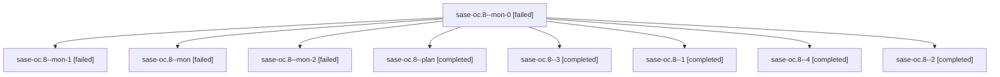

# Family: sase-oc.8

[Agent Hoods](../README.md) / [bbugyi200](../users/bbugyi200/README.md) / [athena](../users/bbugyi200/machines/athena/README.md) / [sase-oc](../users/bbugyi200/machines/athena/hoods/sase-oc/README.md) / sase-oc.8

Owner: `bbugyi200.athena` · Hood: `sase-oc` · Members: 9 · Bead: [sase-oc.8](https://github.com/sase-org/sase--beads/blob/main/pages/sase-oc/sase-oc.8.md)

## Lineage

The diagram is an optional enhancement; the ordered table below contains the same lineage in accessible text.

| Role | Agent | State | Model / provider | Timing | Commits | Prompt | Chat |
|---|---|---|---|---|---:|---|---|
| mon-0 | sase-oc.8--mon-0 | failed | sonnet / claude | 2026-08-17T19:16:36.378803+00:00 | 0 | — | [Chat](../agents/bbugyi200.athena.sase-oc.8--mon-0/chat.md) |
| mon-1 | sase-oc.8--mon-1 | failed | sonnet / claude | 2026-08-17T19:18:01.392129+00:00 | 0 | — | [Chat](../agents/bbugyi200.athena.sase-oc.8--mon-1/chat.md) |
| mon | sase-oc.8--mon | failed | sonnet / claude | 2026-08-17T19:15:21.287152+00:00 | 0 | — | [Chat](../agents/bbugyi200.athena.sase-oc.8--mon/chat.md) |
| mon-2 | sase-oc.8--mon-2 | failed | sonnet / claude | 2026-08-17T19:22:02.066236+00:00 | 0 | — | [Chat](../agents/bbugyi200.athena.sase-oc.8--mon-2/chat.md) |
| plan | sase-oc.8--plan | completed | sonnet / claude | 2026-08-17T18:55:45.291568+00:00 | 0 | [Prompt](../agents/bbugyi200.athena.sase-oc.8--plan/prompt.md) | [Chat](../agents/bbugyi200.athena.sase-oc.8--plan/chat.md) |
| 3 | sase-oc.8--3 | completed | sonnet / claude | 2026-08-17T19:21:08.858284+00:00 | 0 | [Prompt](../agents/bbugyi200.athena.sase-oc.8--3/prompt.md) | [Chat](../agents/bbugyi200.athena.sase-oc.8--3/chat.md) |
| 1 | sase-oc.8--1 | completed | sonnet / claude | 2026-08-17T19:15:55.923618+00:00 | 0 | [Prompt](../agents/bbugyi200.athena.sase-oc.8--1/prompt.md) | [Chat](../agents/bbugyi200.athena.sase-oc.8--1/chat.md) |
| 4 | sase-oc.8--4 | completed | sonnet / claude | 2026-08-17T19:36:29.188123+00:00 | [1](../agents/bbugyi200.athena.sase-oc.8--4/README.md#commits) | [Prompt](../agents/bbugyi200.athena.sase-oc.8--4/prompt.md) | [Chat](../agents/bbugyi200.athena.sase-oc.8--4/chat.md) |
| 2 | sase-oc.8--2 | completed | sonnet / claude | 2026-08-17T19:17:11.550018+00:00 | 0 | [Prompt](../agents/bbugyi200.athena.sase-oc.8--2/prompt.md) | [Chat](../agents/bbugyi200.athena.sase-oc.8--2/chat.md) |

## Commits

| Role | Repo | Commit | Subject | Committed |
|---|---|---|---|---|
| 4 | sase | [`017b488`](https://github.com/sase-org/sase/commit/017b488e6471eee0f8bea2acde8af686d567b087) | docs(completion): document shell completion end to end and close polish items | 2026-08-17 19:38:54 UTC |

## Neighbors

| Agent | Relation | State |
|---|---|---|
| [sase-oc.1](../agents/bbugyi200.athena.sase-oc.1/README.md) | sase-oc hood | completed |
| [sase-oc.2](../agents/bbugyi200.athena.sase-oc.2/README.md) | sase-oc hood | completed |
| [sase-oc.3](../agents/bbugyi200.athena.sase-oc.3/README.md) | sase-oc hood | completed |
| [sase-oc.4](../agents/bbugyi200.athena.sase-oc.4/README.md) | sase-oc hood | completed |
| [sase-oc.5](../agents/bbugyi200.athena.sase-oc.5/README.md) | sase-oc hood | completed |
| [sase-oc.6](../agents/bbugyi200.athena.sase-oc.6/README.md) | sase-oc hood | completed |
| [sase-oc.7](../agents/bbugyi200.athena.sase-oc.7/README.md) | sase-oc hood | completed |
| [sase-oc.land](../agents/bbugyi200.athena.sase-oc.land/README.md) | sase-oc hood | completed |
