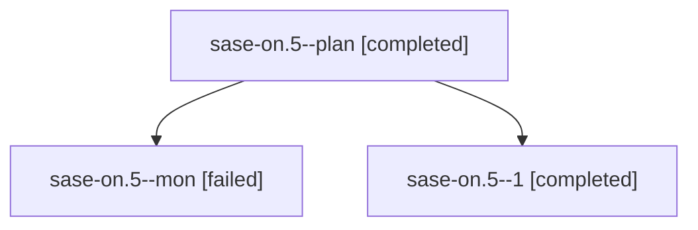

# Family: sase-on.5

[Agent Hoods](../README.md) / [bbugyi200](../users/bbugyi200/README.md) / [athena](../users/bbugyi200/machines/athena/README.md) / [sase-on](../users/bbugyi200/machines/athena/hoods/sase-on/README.md) / sase-on.5

Owner: `bbugyi200.athena` · Hood: `sase-on` · Members: 3 · Bead: [sase-on.5](https://github.com/sase-org/sase--beads/blob/main/pages/sase-on/sase-on.5.md)

## Lineage

The diagram is an optional enhancement; the ordered table below contains the same lineage in accessible text.

| Role | Agent | State | Model / provider | Timing | Commits | Prompt | Chat |
|---|---|---|---|---|---:|---|---|
| plan | sase-on.5--plan | completed | grok-4.6 / grok | 2026-08-17T17:52:39.864629+00:00 | 0 | [Prompt](../agents/bbugyi200.athena.sase-on.5--plan/prompt.md) | [Chat](../agents/bbugyi200.athena.sase-on.5--plan/chat.md) |
| mon | sase-on.5--mon | failed | grok-4.6 / grok | 2026-08-17T18:06:42.810978+00:00 | 0 | — | [Chat](../agents/bbugyi200.athena.sase-on.5--mon/chat.md) |
| 1 | sase-on.5--1 | completed | grok-4.6 / grok | 2026-08-17T18:09:54.108505+00:00 | [2](../agents/bbugyi200.athena.sase-on.5--1/README.md#commits) | [Prompt](../agents/bbugyi200.athena.sase-on.5--1/prompt.md) | [Chat](../agents/bbugyi200.athena.sase-on.5--1/chat.md) |

## Commits

| Role | Repo | Commit | Subject | Committed |
|---|---|---|---|---|
| 1 | sase | [`8c63f5e`](https://github.com/sase-org/sase/commit/8c63f5e121069b264f75863ff57a43d1d80de153) | docs(beads): document task-triage thresholds and stale-cleanup rollout | 2026-08-17 18:17:28 UTC |
| 1 | sase | [`4236695`](https://github.com/sase-org/sase/commit/423669549dafc56db81051a6de57c93b8d7384c0) | chore: drop resolved sase-on epic-symbol whitelist leftovers | 2026-08-17 18:45:30 UTC |

## Neighbors

| Agent | Relation | State |
|---|---|---|
| [sase-on.1](../agents/bbugyi200.athena.sase-on.1/README.md) | sase-on hood | completed |
| [sase-on.2](../agents/bbugyi200.athena.sase-on.2/README.md) | sase-on hood | completed |
| [sase-on.3](../agents/bbugyi200.athena.sase-on.3/README.md) | sase-on hood | completed |
| [sase-on.4](../agents/bbugyi200.athena.sase-on.4/README.md) | sase-on hood | completed |
| [sase-on.land](bbugyi200.athena.sase-on.land.md) (family · 5) | sase-on hood | completed 3, failed 2 |
