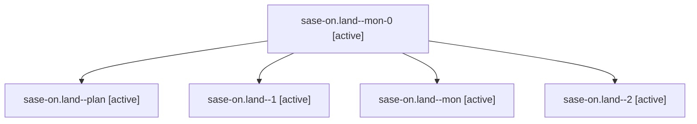

# Family: sase-on.land

[Agent Hoods](../README.md) / [bbugyi200](../users/bbugyi200/README.md) / [athena](../users/bbugyi200/machines/athena/README.md) / [sase-on](../users/bbugyi200/machines/athena/hoods/sase-on/README.md) / sase-on.land

Owner: `bbugyi200.athena` · Hood: `sase-on` · Members: 5 · Bead: [sase-on](https://github.com/sase-org/sase--beads/blob/main/pages/sase-on/README.md)

## Lineage

The diagram is an optional enhancement; the ordered table below contains the same lineage in accessible text.

| Role | Agent | State | Model / provider | Timing | Commits | Prompt | Chat |
|---|---|---|---|---|---:|---|---|
| mon-0 | sase-on.land--mon-0 | active | opus / claude | 2026-08-17T19:24:03.717918+00:00 | 0 | — | — |
| plan | sase-on.land--plan | active | opus / claude | 2026-08-17T18:47:46.326680+00:00 | 0 | [Prompt](../agents/bbugyi200.athena.sase-on.land--plan/prompt.md) | [Chat](../agents/bbugyi200.athena.sase-on.land--plan/chat.md) |
| 1 | sase-on.land--1 | active | opus / claude | 2026-08-17T19:20:53.488266+00:00 | 0 | [Prompt](../agents/bbugyi200.athena.sase-on.land--1/prompt.md) | [Chat](../agents/bbugyi200.athena.sase-on.land--1/chat.md) |
| mon | sase-on.land--mon | active | opus / claude | 2026-08-17T18:57:47.833559+00:00 | 0 | — | — |
| 2 | sase-on.land--2 | active | opus / claude | 2026-08-17T19:55:35.598689+00:00 | 0 | [Prompt](../agents/bbugyi200.athena.sase-on.land--2/prompt.md) | — |

## Neighbors

| Agent | Relation | State |
|---|---|---|
| [sase-on.1](../agents/bbugyi200.athena.sase-on.1/README.md) | sase-on hood | active |
| [sase-on.2](../agents/bbugyi200.athena.sase-on.2/README.md) | sase-on hood | active |
| [sase-on.3](../agents/bbugyi200.athena.sase-on.3/README.md) | sase-on hood | active |
| [sase-on.4](../agents/bbugyi200.athena.sase-on.4/README.md) | sase-on hood | active |
| [sase-on.5](bbugyi200.athena.sase-on.5.md) (family · 3) | sase-on hood | active 3 |
