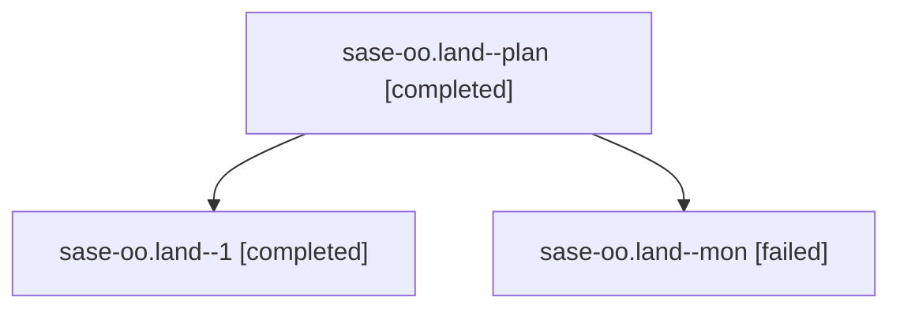

# Family: sase-oo.land

[Agent Hoods](../README.md) / [bbugyi200](../users/bbugyi200/README.md) / [athena](../users/bbugyi200/machines/athena/README.md) / [sase-oo](../users/bbugyi200/machines/athena/hoods/sase-oo/README.md) / sase-oo.land

Owner: `bbugyi200.athena` · Hood: `sase-oo` · Members: 3 · Bead: [sase-oo](https://github.com/sase-org/sase--beads/blob/main/pages/sase-oo/README.md)

## Lineage

The diagram is an optional enhancement; the ordered table below contains the same lineage in accessible text.

| Role | Agent | State | Model / provider | Timing | Commits | Prompt | Chat |
|---|---|---|---|---|---:|---|---|
| plan | sase-oo.land--plan | completed | opus / claude | 2026-08-17T17:21:50.336914+00:00 | 0 | [Prompt](../agents/bbugyi200.athena.sase-oo.land--plan/prompt.md) | [Chat](../agents/bbugyi200.athena.sase-oo.land--plan/chat.md) |
| 1 | sase-oo.land--1 | completed | opus / claude | 2026-08-17T18:05:07.063993+00:00 | [1](../agents/bbugyi200.athena.sase-oo.land--1/README.md#commits) | [Prompt](../agents/bbugyi200.athena.sase-oo.land--1/prompt.md) | [Chat](../agents/bbugyi200.athena.sase-oo.land--1/chat.md) |
| mon | sase-oo.land--mon | failed | opus / claude | 2026-08-17T17:42:25.219183+00:00 | 0 | — | [Chat](../agents/bbugyi200.athena.sase-oo.land--mon/chat.md) |

## Commits

| Role | Repo | Commit | Subject | Committed |
|---|---|---|---|---|
| 1 | sase | [`88a8400`](https://github.com/sase-org/sase/commit/88a84006362c7c040ebf770b1a7dc31d2dec24a6) | build(deps): require sase-core-rs 0.27.18 | 2026-08-17 14:17:31 EDT |

## Neighbors

| Agent | Relation | State |
|---|---|---|
| [sase-oo.1](../agents/bbugyi200.athena.sase-oo.1/README.md) | sase-oo hood | completed |
| [sase-oo.2](../agents/bbugyi200.athena.sase-oo.2/README.md) | sase-oo hood | completed |
| [sase-oo.3](../agents/bbugyi200.athena.sase-oo.3/README.md) | sase-oo hood | completed |
| [sase-oo.4](../agents/bbugyi200.athena.sase-oo.4/README.md) | sase-oo hood | completed |
