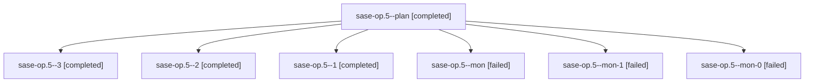

# Family: sase-op.5

[Agent Hoods](../README.md) / [bbugyi200](../users/bbugyi200/README.md) / [athena](../users/bbugyi200/machines/athena/README.md) / [sase-op](../users/bbugyi200/machines/athena/hoods/sase-op/README.md) / sase-op.5

Owner: `bbugyi200.athena` · Hood: `sase-op` · Members: 7 · Bead: [sase-op.5](https://github.com/sase-org/sase--beads/blob/main/pages/sase-op/sase-op.5.md)

## Lineage

The diagram is an optional enhancement; the ordered table below contains the same lineage in accessible text.

| Role | Agent | State | Model / provider | Timing | Commits | Prompt | Chat |
|---|---|---|---|---|---:|---|---|
| plan | sase-op.5--plan | completed | sonnet / claude | 2026-08-17T18:38:18.875728+00:00 | 0 | [Prompt](../agents/bbugyi200.athena.sase-op.5--plan/prompt.md) | [Chat](../agents/bbugyi200.athena.sase-op.5--plan/chat.md) |
| 3 | sase-op.5--3 | completed | sonnet / claude | 2026-08-17T19:33:46.361364+00:00 | [1](../agents/bbugyi200.athena.sase-op.5--3/README.md#commits) | [Prompt](../agents/bbugyi200.athena.sase-op.5--3/prompt.md) | [Chat](../agents/bbugyi200.athena.sase-op.5--3/chat.md) |
| 2 | sase-op.5--2 | completed | sonnet / claude | 2026-08-17T19:10:11.382702+00:00 | 0 | [Prompt](../agents/bbugyi200.athena.sase-op.5--2/prompt.md) | [Chat](../agents/bbugyi200.athena.sase-op.5--2/chat.md) |
| 1 | sase-op.5--1 | completed | sonnet / claude | 2026-08-17T19:06:51.754536+00:00 | 0 | [Prompt](../agents/bbugyi200.athena.sase-op.5--1/prompt.md) | [Chat](../agents/bbugyi200.athena.sase-op.5--1/chat.md) |
| mon | sase-op.5--mon | failed | sonnet / claude | 2026-08-17T19:06:18.418706+00:00 | 0 | — | [Chat](../agents/bbugyi200.athena.sase-op.5--mon/chat.md) |
| mon-1 | sase-op.5--mon-1 | failed | sonnet / claude | 2026-08-17T19:13:19.593024+00:00 | 0 | — | [Chat](../agents/bbugyi200.athena.sase-op.5--mon-1/chat.md) |
| mon-0 | sase-op.5--mon-0 | failed | sonnet / claude | 2026-08-17T19:07:29.506641+00:00 | 0 | — | [Chat](../agents/bbugyi200.athena.sase-op.5--mon-0/chat.md) |

## Commits

| Role | Repo | Commit | Subject | Committed |
|---|---|---|---|---|
| 3 | sase | [`d3f77b8`](https://github.com/sase-org/sase/commit/d3f77b800772b99909f6d40e410ff776a6533b56) | feat(glossary): render per-agent glossary reads in the metadata panel | 2026-08-17 15:36:07 EDT |

## Neighbors

| Agent | Relation | State |
|---|---|---|
| [sase-op.1](../agents/bbugyi200.athena.sase-op.1/README.md) | sase-op hood | completed |
| [sase-op.2](../agents/bbugyi200.athena.sase-op.2/README.md) | sase-op hood | dismissed |
| [sase-op.3](../agents/bbugyi200.athena.sase-op.3/README.md) | sase-op hood | completed |
| [sase-op.4](../agents/bbugyi200.athena.sase-op.4/README.md) | sase-op hood | completed |
| [sase-op.6](../agents/bbugyi200.athena.sase-op.6/README.md) | sase-op hood | active |
| [sase-op.land](../agents/bbugyi200.athena.sase-op.land/README.md) | sase-op hood | waiting |
