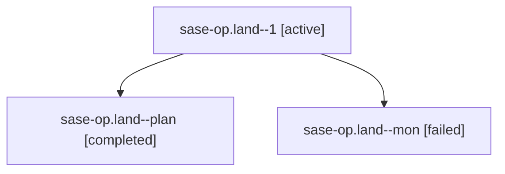

# Family: sase-op.land

[Agent Hoods](../README.md) / [bbugyi200](../users/bbugyi200/README.md) / [athena](../users/bbugyi200/machines/athena/README.md) / [sase-op](../users/bbugyi200/machines/athena/hoods/sase-op/README.md) / sase-op.land

Owner: `bbugyi200.athena` · Hood: `sase-op` · Members: 3 · Bead: [sase-op](https://github.com/sase-org/sase--beads/blob/main/pages/sase-op/README.md)

## Lineage

The diagram is an optional enhancement; the ordered table below contains the same lineage in accessible text.

| Role | Agent | State | Model / provider | Timing | Commits | Prompt | Chat |
|---|---|---|---|---|---:|---|---|
| 1 | sase-op.land--1 | active | opus / claude | 2026-08-17T20:37:30.895210+00:00 | [1](../agents/bbugyi200.athena.sase-op.land--1/README.md#commits) | [Prompt](../agents/bbugyi200.athena.sase-op.land--1/prompt.md) | — |
| plan | sase-op.land--plan | completed | opus / claude | 2026-08-17T20:00:33.708548+00:00 | 0 | [Prompt](../agents/bbugyi200.athena.sase-op.land--plan/prompt.md) | [Chat](../agents/bbugyi200.athena.sase-op.land--plan/chat.md) |
| mon | sase-op.land--mon | failed | opus / claude | 2026-08-17T20:23:24.207506+00:00 | 0 | — | [Chat](../agents/bbugyi200.athena.sase-op.land--mon/chat.md) |

## Commits

| Role | Repo | Commit | Subject | Committed |
|---|---|---|---|---|
| 1 | sase | [`d5ac426`](https://github.com/sase-org/sase/commit/d5ac4269303f6b098aa6e242b8a3185e334a4b71) | refactor(glossary): retire the epic-symbol exemptions for sase-op | 2026-08-17 20:55:47 UTC |

## Neighbors

| Agent | Relation | State |
|---|---|---|
| [sase-op.1](../agents/bbugyi200.athena.sase-op.1/README.md) | sase-op hood | completed |
| [sase-op.2](../agents/bbugyi200.athena.sase-op.2/README.md) | sase-op hood | dismissed |
| [sase-op.3](../agents/bbugyi200.athena.sase-op.3/README.md) | sase-op hood | completed |
| [sase-op.4](../agents/bbugyi200.athena.sase-op.4/README.md) | sase-op hood | completed |
| [sase-op.5](bbugyi200.athena.sase-op.5.md) (family · 7) | sase-op hood | completed 4, failed 3 |
| [sase-op.6](../agents/bbugyi200.athena.sase-op.6/README.md) | sase-op hood | completed |
