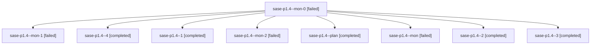

# Family: sase-p1.4

[Agent Hoods](../README.md) / [bbugyi200](../users/bbugyi200/README.md) / [athena](../users/bbugyi200/machines/athena/README.md) / [sase-p1](../users/bbugyi200/machines/athena/hoods/sase-p1/README.md) / sase-p1.4

Owner: `bbugyi200.athena` · Hood: `sase-p1` · Members: 9 · Bead: [sase-p1.4](https://github.com/sase-org/sase--beads/blob/main/pages/sase-p1/sase-p1.4.md)

## Lineage

The diagram is an optional enhancement; the ordered table below contains the same lineage in accessible text.

| Role | Agent | State | Model / provider | Timing | Commits | Prompt | Chat |
|---|---|---|---|---|---:|---|---|
| mon-0 | sase-p1.4--mon-0 | failed | sonnet / claude | 2026-08-18T00:44:32.279908+00:00 | 0 | — | [Chat](../agents/bbugyi200.athena.sase-p1.4--mon-0/chat.md) |
| mon-1 | sase-p1.4--mon-1 | failed | sonnet / claude | 2026-08-18T01:04:50.049700+00:00 | 0 | — | [Chat](../agents/bbugyi200.athena.sase-p1.4--mon-1/chat.md) |
| 4 | sase-p1.4--4 | completed | sonnet / claude | 2026-08-18T01:26:51.964237+00:00 | 0 | [Prompt](../agents/bbugyi200.athena.sase-p1.4--4/prompt.md) | [Chat](../agents/bbugyi200.athena.sase-p1.4--4/chat.md) |
| 1 | sase-p1.4--1 | completed | sonnet / claude | 2026-08-18T00:43:37.989180+00:00 | 0 | [Prompt](../agents/bbugyi200.athena.sase-p1.4--1/prompt.md) | [Chat](../agents/bbugyi200.athena.sase-p1.4--1/chat.md) |
| mon-2 | sase-p1.4--mon-2 | failed | sonnet / claude | 2026-08-18T01:09:08.389687+00:00 | 0 | — | [Chat](../agents/bbugyi200.athena.sase-p1.4--mon-2/chat.md) |
| plan | sase-p1.4--plan | completed | sonnet / claude | 2026-08-18T00:12:55.362603+00:00 | 0 | [Prompt](../agents/bbugyi200.athena.sase-p1.4--plan/prompt.md) | [Chat](../agents/bbugyi200.athena.sase-p1.4--plan/chat.md) |
| mon | sase-p1.4--mon | failed | sonnet / claude | 2026-08-18T00:41:47.428286+00:00 | 0 | — | [Chat](../agents/bbugyi200.athena.sase-p1.4--mon/chat.md) |
| 2 | sase-p1.4--2 | completed | sonnet / claude | 2026-08-18T01:02:33.777520+00:00 | 0 | [Prompt](../agents/bbugyi200.athena.sase-p1.4--2/prompt.md) | [Chat](../agents/bbugyi200.athena.sase-p1.4--2/chat.md) |
| 3 | sase-p1.4--3 | completed | sonnet / claude | 2026-08-18T01:07:05.198942+00:00 | 0 | [Prompt](../agents/bbugyi200.athena.sase-p1.4--3/prompt.md) | [Chat](../agents/bbugyi200.athena.sase-p1.4--3/chat.md) |

## Neighbors

| Agent | Relation | State |
|---|---|---|
| [sase-p1.1](../agents/bbugyi200.athena.sase-p1.1/README.md) | sase-p1 hood | dismissed |
| [sase-p1.2](../agents/bbugyi200.athena.sase-p1.2/README.md) | sase-p1 hood | completed |
| [sase-p1.3](../agents/bbugyi200.athena.sase-p1.3/README.md) | sase-p1 hood | completed |
| [sase-p1.5](../agents/bbugyi200.athena.sase-p1.5/README.md) | sase-p1 hood | completed |
| [sase-p1.6](bbugyi200.athena.sase-p1.6.md) (family · 7) | sase-p1 hood | completed 4, failed 3 |
| [sase-p1.7](../agents/bbugyi200.athena.sase-p1.7/README.md) | sase-p1 hood | completed |
| [sase-p1.8](../agents/bbugyi200.athena.sase-p1.8/README.md) | sase-p1 hood | completed |
| [sase-p1.land](../agents/bbugyi200.athena.sase-p1.land/README.md) | sase-p1 hood | active |
