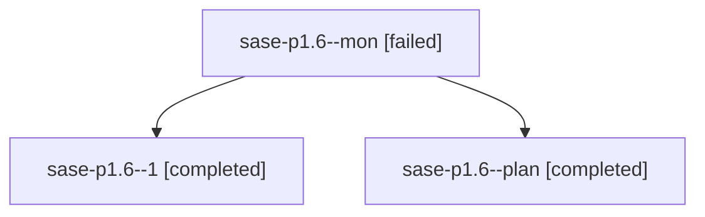

# Family: sase-p1.6

[Agent Hoods](../README.md) / [bbugyi200](../users/bbugyi200/README.md) / [athena](../users/bbugyi200/machines/athena/README.md) / [sase-p1](../users/bbugyi200/machines/athena/hoods/sase-p1/README.md) / sase-p1.6

Owner: `bbugyi200.athena` · Hood: `sase-p1` · Members: 3 · Bead: [sase-p1.6](https://github.com/sase-org/sase--beads/blob/main/pages/sase-p1/sase-p1.6.md)

## Lineage

The diagram is an optional enhancement; the ordered table below contains the same lineage in accessible text.

| Role | Agent | State | Model / provider | Timing | Commits | Prompt | Chat |
|---|---|---|---|---|---:|---|---|
| mon | sase-p1.6--mon | failed | grok-4.6 / grok | 2026-08-18T02:09:44.762504+00:00 | 0 | — | [Chat](../agents/bbugyi200.athena.sase-p1.6--mon/chat.md) |
| 1 | sase-p1.6--1 | completed | grok-4.6 / grok | 2026-08-18T02:12:49.145939+00:00 | 0 | [Prompt](../agents/bbugyi200.athena.sase-p1.6--1/prompt.md) | [Chat](../agents/bbugyi200.athena.sase-p1.6--1/chat.md) |
| plan | sase-p1.6--plan | completed | grok-4.6 / grok | 2026-08-18T01:38:32.632265+00:00 | 0 | [Prompt](../agents/bbugyi200.athena.sase-p1.6--plan/prompt.md) | [Chat](../agents/bbugyi200.athena.sase-p1.6--plan/chat.md) |

## Neighbors

| Agent | Relation | State |
|---|---|---|
| [sase-p1.1](../agents/bbugyi200.athena.sase-p1.1/README.md) | sase-p1 hood | dismissed |
| [sase-p1.2](../agents/bbugyi200.athena.sase-p1.2/README.md) | sase-p1 hood | completed |
| [sase-p1.3](../agents/bbugyi200.athena.sase-p1.3/README.md) | sase-p1 hood | completed |
| [sase-p1.4](bbugyi200.athena.sase-p1.4.md) (family · 9) | sase-p1 hood | completed 5, failed 4 |
| [sase-p1.5](../agents/bbugyi200.athena.sase-p1.5/README.md) | sase-p1 hood | active |
| [sase-p1.7](../agents/bbugyi200.athena.sase-p1.7/README.md) | sase-p1 hood | waiting |
| [sase-p1.8](../agents/bbugyi200.athena.sase-p1.8/README.md) | sase-p1 hood | waiting |
| [sase-p1.land](../agents/bbugyi200.athena.sase-p1.land/README.md) | sase-p1 hood | waiting |
