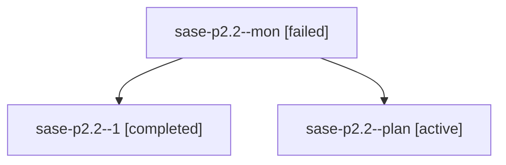

# Family: sase-p2.2

[Agent Hoods](../README.md) / [bbugyi200](../users/bbugyi200/README.md) / [athena](../users/bbugyi200/machines/athena/README.md) / [sase-p2](../users/bbugyi200/machines/athena/hoods/sase-p2/README.md) / sase-p2.2

Owner: `bbugyi200.athena` · Hood: `sase-p2` · Members: 3 · Bead: [sase-p2.2](https://github.com/sase-org/sase--beads/blob/main/pages/sase-p2/sase-p2.2.md)

## Lineage

The diagram is an optional enhancement; the ordered table below contains the same lineage in accessible text.

| Role | Agent | State | Model / provider | Timing | Commits | Prompt | Chat |
|---|---|---|---|---|---:|---|---|
| mon | sase-p2.2--mon | failed | grok-4.6 / grok | 2026-08-17T23:58:07.462435+00:00 | 0 | — | [Chat](../agents/bbugyi200.athena.sase-p2.2--mon/chat.md) |
| 1 | sase-p2.2--1 | completed | grok-4.6 / grok | 2026-08-18T00:43:44.441303+00:00 | 0 | [Prompt](../agents/bbugyi200.athena.sase-p2.2--1/prompt.md) | [Chat](../agents/bbugyi200.athena.sase-p2.2--1/chat.md) |
| plan | sase-p2.2--plan | active | grok-4.6 / grok | 2026-08-17T23:12:27.721877+00:00 | 0 | [Prompt](../agents/bbugyi200.athena.sase-p2.2--plan/prompt.md) | [Chat](../agents/bbugyi200.athena.sase-p2.2--plan/chat.md) |

## Commits

| Role | Repo | Commit | Subject | Committed |
|---|---|---|---|---|
| — | sase | [`6c41322`](https://github.com/sase-org/sase/commit/6c4132221e506c72171827e40d9e52693b167d7c) | feat(ace): highlight repo names in the prompt as lavender links | 2026-08-17 20:52:32 EDT |

## Neighbors

| Agent | Relation | State |
|---|---|---|
| [sase-p2.1](../agents/bbugyi200.athena.sase-p2.1/README.md) | sase-p2 hood | active |
| [sase-p2.3](bbugyi200.athena.sase-p2.3.md) (family · 11) | sase-p2 hood | active 1, completed 5, failed 5 |
| [sase-p2.4](bbugyi200.athena.sase-p2.4.md) (family · 5) | sase-p2 hood | active 1, completed 2, failed 2 |
| [sase-p2.land](bbugyi200.athena.sase-p2.land.md) (family · 3) | sase-p2 hood | active 1, completed 1, failed 1 |
