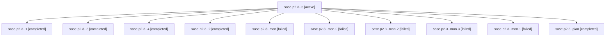

# Family: sase-p2.3

[Agent Hoods](../README.md) / [bbugyi200](../users/bbugyi200/README.md) / [athena](../users/bbugyi200/machines/athena/README.md) / [sase-p2](../users/bbugyi200/machines/athena/hoods/sase-p2/README.md) / sase-p2.3

Owner: `bbugyi200.athena` · Hood: `sase-p2` · Members: 11 · Bead: [sase-p2.3](https://github.com/sase-org/sase--beads/blob/main/pages/sase-p2/sase-p2.3.md)

## Lineage

The diagram is an optional enhancement; the ordered table below contains the same lineage in accessible text.

| Role | Agent | State | Model / provider | Timing | Commits | Prompt | Chat |
|---|---|---|---|---|---:|---|---|
| 5 | sase-p2.3--5 | active | sonnet / claude | 2026-08-18T01:59:41.314041+00:00 | 0 | [Prompt](../agents/bbugyi200.athena.sase-p2.3--5/prompt.md) | — |
| 1 | sase-p2.3--1 | completed | sonnet / claude | 2026-08-18T01:13:29.391399+00:00 | 0 | [Prompt](../agents/bbugyi200.athena.sase-p2.3--1/prompt.md) | [Chat](../agents/bbugyi200.athena.sase-p2.3--1/chat.md) |
| 3 | sase-p2.3--3 | completed | sonnet / claude | 2026-08-18T01:33:39.024688+00:00 | 0 | [Prompt](../agents/bbugyi200.athena.sase-p2.3--3/prompt.md) | [Chat](../agents/bbugyi200.athena.sase-p2.3--3/chat.md) |
| 4 | sase-p2.3--4 | completed | sonnet / claude | 2026-08-18T01:36:58.241962+00:00 | 0 | [Prompt](../agents/bbugyi200.athena.sase-p2.3--4/prompt.md) | [Chat](../agents/bbugyi200.athena.sase-p2.3--4/chat.md) |
| 2 | sase-p2.3--2 | completed | sonnet / claude | 2026-08-18T01:17:27.920549+00:00 | 0 | [Prompt](../agents/bbugyi200.athena.sase-p2.3--2/prompt.md) | [Chat](../agents/bbugyi200.athena.sase-p2.3--2/chat.md) |
| mon | sase-p2.3--mon | failed | sonnet / claude | 2026-08-18T01:10:35.060367+00:00 | 0 | — | [Chat](../agents/bbugyi200.athena.sase-p2.3--mon/chat.md) |
| mon-0 | sase-p2.3--mon-0 | failed | sonnet / claude | 2026-08-18T01:15:09.983965+00:00 | 0 | — | [Chat](../agents/bbugyi200.athena.sase-p2.3--mon-0/chat.md) |
| mon-2 | sase-p2.3--mon-2 | failed | sonnet / claude | 2026-08-18T01:34:42.904507+00:00 | 0 | — | [Chat](../agents/bbugyi200.athena.sase-p2.3--mon-2/chat.md) |
| mon-3 | sase-p2.3--mon-3 | failed | sonnet / claude | 2026-08-18T01:39:25.775259+00:00 | 0 | — | [Chat](../agents/bbugyi200.athena.sase-p2.3--mon-3/chat.md) |
| mon-1 | sase-p2.3--mon-1 | failed | sonnet / claude | 2026-08-18T01:18:38.757280+00:00 | 0 | — | [Chat](../agents/bbugyi200.athena.sase-p2.3--mon-1/chat.md) |
| plan | sase-p2.3--plan | completed | sonnet / claude | 2026-08-18T00:55:26.124181+00:00 | 0 | [Prompt](../agents/bbugyi200.athena.sase-p2.3--plan/prompt.md) | [Chat](../agents/bbugyi200.athena.sase-p2.3--plan/chat.md) |

## Neighbors

| Agent | Relation | State |
|---|---|---|
| [sase-p2.1](../agents/bbugyi200.athena.sase-p2.1/README.md) | sase-p2 hood | completed |
| [sase-p2.2](bbugyi200.athena.sase-p2.2.md) (family · 3) | sase-p2 hood | completed 2, failed 1 |
| [sase-p2.4](../agents/bbugyi200.athena.sase-p2.4/README.md) | sase-p2 hood | waiting |
| [sase-p2.land](../agents/bbugyi200.athena.sase-p2.land/README.md) | sase-p2 hood | waiting |
