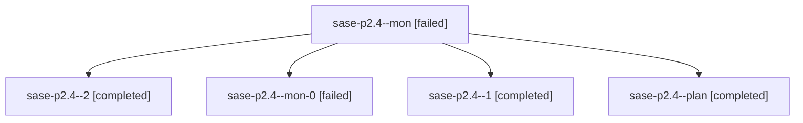

# Family: sase-p2.4

[Agent Hoods](../README.md) / [bbugyi200](../users/bbugyi200/README.md) / [athena](../users/bbugyi200/machines/athena/README.md) / [sase-p2](../users/bbugyi200/machines/athena/hoods/sase-p2/README.md) / sase-p2.4

Owner: `bbugyi200.athena` · Hood: `sase-p2` · Members: 5 · Bead: [sase-p2.4](https://github.com/sase-org/sase--beads/blob/main/pages/sase-p2/sase-p2.4.md)

## Lineage

The diagram is an optional enhancement; the ordered table below contains the same lineage in accessible text.

| Role | Agent | State | Model / provider | Timing | Commits | Prompt | Chat |
|---|---|---|---|---|---:|---|---|
| mon | sase-p2.4--mon | failed | sonnet / claude | 2026-08-18T02:24:30.679953+00:00 | 0 | — | [Chat](../agents/bbugyi200.athena.sase-p2.4--mon/chat.md) |
| 2 | sase-p2.4--2 | completed | sonnet / claude | 2026-08-18T02:34:20.790926+00:00 | 0 | [Prompt](../agents/bbugyi200.athena.sase-p2.4--2/prompt.md) | [Chat](../agents/bbugyi200.athena.sase-p2.4--2/chat.md) |
| mon-0 | sase-p2.4--mon-0 | failed | sonnet / claude | 2026-08-18T02:31:11.810216+00:00 | 0 | — | [Chat](../agents/bbugyi200.athena.sase-p2.4--mon-0/chat.md) |
| 1 | sase-p2.4--1 | completed | sonnet / claude | 2026-08-18T02:27:38.839042+00:00 | 0 | [Prompt](../agents/bbugyi200.athena.sase-p2.4--1/prompt.md) | [Chat](../agents/bbugyi200.athena.sase-p2.4--1/chat.md) |
| plan | sase-p2.4--plan | completed | sonnet / claude | 2026-08-18T02:05:24.782389+00:00 | 0 | [Prompt](../agents/bbugyi200.athena.sase-p2.4--plan/prompt.md) | [Chat](../agents/bbugyi200.athena.sase-p2.4--plan/chat.md) |

## Neighbors

| Agent | Relation | State |
|---|---|---|
| [sase-p2.1](../agents/bbugyi200.athena.sase-p2.1/README.md) | sase-p2 hood | completed |
| [sase-p2.2](bbugyi200.athena.sase-p2.2.md) (family · 3) | sase-p2 hood | completed 2, failed 1 |
| [sase-p2.3](bbugyi200.athena.sase-p2.3.md) (family · 11) | sase-p2 hood | completed 6, failed 5 |
| [sase-p2.land](bbugyi200.athena.sase-p2.land.md) (family · 3) | sase-p2 hood | active 1, completed 1, failed 1 |
