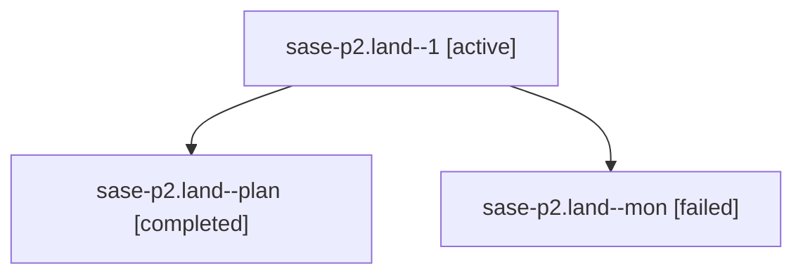

# Family: sase-p2.land

[Agent Hoods](../README.md) / [bbugyi200](../users/bbugyi200/README.md) / [athena](../users/bbugyi200/machines/athena/README.md) / [sase-p2](../users/bbugyi200/machines/athena/hoods/sase-p2/README.md) / sase-p2.land

Owner: `bbugyi200.athena` · Hood: `sase-p2` · Members: 3 · Bead: [sase-p2](https://github.com/sase-org/sase--beads/blob/main/pages/sase-p2/README.md)

## Lineage

The diagram is an optional enhancement; the ordered table below contains the same lineage in accessible text.

| Role | Agent | State | Model / provider | Timing | Commits | Prompt | Chat |
|---|---|---|---|---|---:|---|---|
| 1 | sase-p2.land--1 | active | opus / claude | 2026-08-18T03:05:33.482962+00:00 | [1](../agents/bbugyi200.athena.sase-p2.land--1/README.md#commits) | [Prompt](../agents/bbugyi200.athena.sase-p2.land--1/prompt.md) | — |
| plan | sase-p2.land--plan | completed | opus / claude | 2026-08-18T02:43:18.261546+00:00 | 0 | [Prompt](../agents/bbugyi200.athena.sase-p2.land--plan/prompt.md) | [Chat](../agents/bbugyi200.athena.sase-p2.land--plan/chat.md) |
| mon | sase-p2.land--mon | failed | opus / claude | 2026-08-18T03:03:08.313490+00:00 | 0 | — | [Chat](../agents/bbugyi200.athena.sase-p2.land--mon/chat.md) |

## Commits

| Role | Repo | Commit | Subject | Committed |
|---|---|---|---|---|
| 1 | sase | [`9a3327a`](https://github.com/sase-org/sase/commit/9a3327a3b5053fea8c43e1feef6cd2963000d793) | test(ace): expect the repo-aware Ctrl+\] help label | 2026-08-17 23:38:48 EDT |

## Neighbors

| Agent | Relation | State |
|---|---|---|
| [sase-p2.1](../agents/bbugyi200.athena.sase-p2.1/README.md) | sase-p2 hood | completed |
| [sase-p2.2](bbugyi200.athena.sase-p2.2.md) (family · 3) | sase-p2 hood | completed 2, failed 1 |
| [sase-p2.3](bbugyi200.athena.sase-p2.3.md) (family · 11) | sase-p2 hood | completed 6, failed 5 |
| [sase-p2.4](bbugyi200.athena.sase-p2.4.md) (family · 5) | sase-p2 hood | completed 3, failed 2 |
