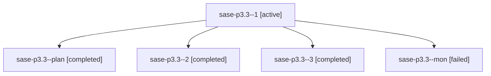

# Family: sase-p3.3

[Agent Hoods](../README.md) / [bbugyi200](../users/bbugyi200/README.md) / [athena](../users/bbugyi200/machines/athena/README.md) / [sase-p3](../users/bbugyi200/machines/athena/hoods/sase-p3/README.md) / sase-p3.3

Owner: `bbugyi200.athena` · Hood: `sase-p3` · Members: 5 · Bead: [sase-p3.3](https://github.com/sase-org/sase--beads/blob/main/pages/sase-p3/sase-p3.3.md)

## Lineage

The diagram is an optional enhancement; the ordered table below contains the same lineage in accessible text.

| Role | Agent | State | Model / provider | Timing | Commits | Prompt | Chat |
|---|---|---|---|---|---:|---|---|
| 1 | sase-p3.3--1 | active | sonnet / claude | 2026-08-17T23:23:04.726904+00:00 | 0 | — | [Chat](../agents/bbugyi200.athena.sase-p3.3--1/chat.md) |
| plan | sase-p3.3--plan | completed | sonnet / claude | 2026-08-17T22:51:37.356981+00:00 | 0 | [Prompt](../agents/bbugyi200.athena.sase-p3.3--plan/prompt.md) | [Chat](../agents/bbugyi200.athena.sase-p3.3--plan/chat.md) |
| 2 | sase-p3.3--2 | completed | grok-4.6 / grok | 2026-08-17T23:51:43.334116+00:00 | 0 | — | [Chat](../agents/bbugyi200.athena.sase-p3.3--2/chat.md) |
| 3 | sase-p3.3--3 | completed | grok-4.6 / grok | 2026-08-18T01:12:08.701169+00:00 | [1](../agents/bbugyi200.athena.sase-p3.3--3/README.md#commits) | [Prompt](../agents/bbugyi200.athena.sase-p3.3--3/prompt.md) | [Chat](../agents/bbugyi200.athena.sase-p3.3--3/chat.md) |
| mon | sase-p3.3--mon | failed | grok-4.6 / grok | 2026-08-18T00:36:01.831495+00:00 | 0 | — | [Chat](../agents/bbugyi200.athena.sase-p3.3--mon/chat.md) |

## Commits

| Role | Repo | Commit | Subject | Committed |
|---|---|---|---|---|
| 3 | sase | [`54da09b`](https://github.com/sase-org/sase/commit/54da09ba5c0aeca06d27ff6b7c8bbfd75c7925ba) | feat(config)!: require plugin prefix on every use: field | 2026-08-17 21:18:39 EDT |

## Neighbors

| Agent | Relation | State |
|---|---|---|
| [sase-p3.1](../agents/bbugyi200.athena.sase-p3.1/README.md) | sase-p3 hood | completed |
| [sase-p3.10](../agents/bbugyi200.athena.sase-p3.10/README.md) | sase-p3 hood | active |
| [sase-p3.11](../agents/bbugyi200.athena.sase-p3.11/README.md) | sase-p3 hood | completed |
| [sase-p3.12](../agents/bbugyi200.athena.sase-p3.12/README.md) | sase-p3 hood | waiting |
| [sase-p3.13](../agents/bbugyi200.athena.sase-p3.13/README.md) | sase-p3 hood | waiting |
| [sase-p3.14](../agents/bbugyi200.athena.sase-p3.14/README.md) | sase-p3 hood | waiting |
| [sase-p3.2](../agents/bbugyi200.athena.sase-p3.2/README.md) | sase-p3 hood | completed |
| [sase-p3.4](../agents/bbugyi200.athena.sase-p3.4/README.md) | sase-p3 hood | completed |
| [sase-p3.5](../agents/bbugyi200.athena.sase-p3.5/README.md) | sase-p3 hood | completed |
| [sase-p3.6](../agents/bbugyi200.athena.sase-p3.6/README.md) | sase-p3 hood | completed |
| [sase-p3.7](../agents/bbugyi200.athena.sase-p3.7/README.md) | sase-p3 hood | active |
| [sase-p3.8](../agents/bbugyi200.athena.sase-p3.8/README.md) | sase-p3 hood | waiting |
| [sase-p3.9](../agents/bbugyi200.athena.sase-p3.9/README.md) | sase-p3 hood | waiting |
| [sase-p3.land](../agents/bbugyi200.athena.sase-p3.land/README.md) | sase-p3 hood | waiting |
