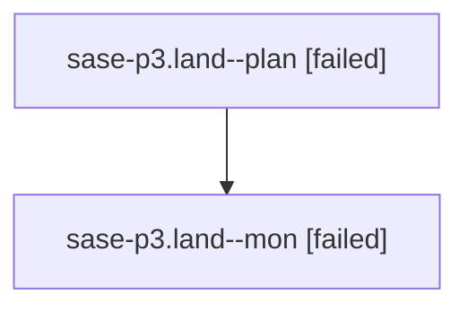

# Family: sase-p3.land

[Agent Hoods](../README.md) / [bbugyi200](../users/bbugyi200/README.md) / [athena](../users/bbugyi200/machines/athena/README.md) / [sase-p3](../users/bbugyi200/machines/athena/hoods/sase-p3/README.md) / sase-p3.land

Owner: `bbugyi200.athena` · Hood: `sase-p3` · Members: 2 · Bead: [sase-p3](https://github.com/sase-org/sase--beads/blob/main/pages/sase-p3/README.md)

## Lineage

The diagram is an optional enhancement; the ordered table below contains the same lineage in accessible text.

| Role | Agent | State | Model / provider | Timing | Commits | Prompt | Chat |
|---|---|---|---|---|---:|---|---|
| plan | sase-p3.land--plan | failed | opus / claude | 2026-08-18T08:14:10.022720+00:00 | 0 | [Prompt](../agents/bbugyi200.athena.sase-p3.land--plan/prompt.md) | [Chat](../agents/bbugyi200.athena.sase-p3.land--plan/chat.md) |
| mon | sase-p3.land--mon | failed | opus / claude | 2026-08-18T08:37:32.642434+00:00 | 0 | — | [Chat](../agents/bbugyi200.athena.sase-p3.land--mon/chat.md) |

## Neighbors

| Agent | Relation | State |
|---|---|---|
| [sase-p3.1](../agents/bbugyi200.athena.sase-p3.1/README.md) | sase-p3 hood | completed |
| [sase-p3.10](../agents/bbugyi200.athena.sase-p3.10/README.md) | sase-p3 hood | completed |
| [sase-p3.11](../agents/bbugyi200.athena.sase-p3.11/README.md) | sase-p3 hood | completed |
| [sase-p3.12](../agents/bbugyi200.athena.sase-p3.12/README.md) | sase-p3 hood | completed |
| [sase-p3.13](../agents/bbugyi200.athena.sase-p3.13/README.md) | sase-p3 hood | completed |
| [sase-p3.14](bbugyi200.athena.sase-p3.14.md) (family · 3) | sase-p3 hood | completed 2, failed 1 |
| [sase-p3.15.1](../agents/bbugyi200.athena.sase-p3.15.1/README.md) | sase-p3 hood | completed |
| [sase-p3.15.2](bbugyi200.athena.sase-p3.15.2.md) (family · 9) | sase-p3 hood | active 1, completed 4, failed 4 |
| [sase-p3.15.3](../agents/bbugyi200.athena.sase-p3.15.3/README.md) | sase-p3 hood | completed |
| [sase-p3.15.land](../agents/bbugyi200.athena.sase-p3.15.land/README.md) | sase-p3 hood | waiting |
| [sase-p3.2](../agents/bbugyi200.athena.sase-p3.2/README.md) | sase-p3 hood | completed |
| [sase-p3.3](bbugyi200.athena.sase-p3.3.md) (family · 5) | sase-p3 hood | active 1, completed 3, failed 1 |
| [sase-p3.4](../agents/bbugyi200.athena.sase-p3.4/README.md) | sase-p3 hood | completed |
| [sase-p3.5](../agents/bbugyi200.athena.sase-p3.5/README.md) | sase-p3 hood | completed |
| [sase-p3.6](../agents/bbugyi200.athena.sase-p3.6/README.md) | sase-p3 hood | completed |
| [sase-p3.7](../agents/bbugyi200.athena.sase-p3.7/README.md) | sase-p3 hood | completed |
| [sase-p3.8](../agents/bbugyi200.athena.sase-p3.8/README.md) | sase-p3 hood | completed |
| [sase-p3.9](../agents/bbugyi200.athena.sase-p3.9/README.md) | sase-p3 hood | completed |
