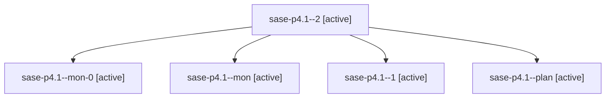

# Family: sase-p4.1

[Agent Hoods](../README.md) / [bbugyi200](../users/bbugyi200/README.md) / [athena](../users/bbugyi200/machines/athena/README.md) / [sase-p4](../users/bbugyi200/machines/athena/hoods/sase-p4/README.md) / sase-p4.1

Owner: `bbugyi200.athena` · Hood: `sase-p4` · Members: 5 · Bead: [sase-p4.1](https://github.com/sase-org/sase--beads/blob/main/pages/sase-p4/sase-p4.1.md)

## Lineage

The diagram is an optional enhancement; the ordered table below contains the same lineage in accessible text.

| Role | Agent | State | Model / provider | Timing | Commits | Prompt | Chat |
|---|---|---|---|---|---:|---|---|
| 2 | sase-p4.1--2 | active | grok-4.6 / grok | 2026-08-18T00:47:25.459183+00:00 | 0 | [Prompt](../agents/bbugyi200.athena.sase-p4.1--2/prompt.md) | — |
| mon-0 | sase-p4.1--mon-0 | active | grok-4.6 / grok | 2026-08-17T23:40:15.162066+00:00 | 0 | — | — |
| mon | sase-p4.1--mon | active | grok-4.6 / grok | 2026-08-17T23:25:26.302011+00:00 | 0 | — | — |
| 1 | sase-p4.1--1 | active | grok-4.6 / grok | 2026-08-17T23:28:07.498937+00:00 | 0 | [Prompt](../agents/bbugyi200.athena.sase-p4.1--1/prompt.md) | [Chat](../agents/bbugyi200.athena.sase-p4.1--1/chat.md) |
| plan | sase-p4.1--plan | active | grok-4.6 / grok | 2026-08-17T22:54:54.773010+00:00 | 0 | [Prompt](../agents/bbugyi200.athena.sase-p4.1--plan/prompt.md) | [Chat](../agents/bbugyi200.athena.sase-p4.1--plan/chat.md) |

## Commits

| Role | Repo | Commit | Subject | Committed |
|---|---|---|---|---|
| — | sase | [`567605a`](https://github.com/sase-org/sase/commit/567605a8fba6c157337d689c6f862be025f642ab) | feat(bead): add shared epic stall detection policy | 2026-08-17 21:03:00 EDT |

## Neighbors

| Agent | Relation | State |
|---|---|---|
| [sase-p4.2](../agents/bbugyi200.athena.sase-p4.2/README.md) | sase-p4 hood | active |
| [sase-p4.3](bbugyi200.athena.sase-p4.3.md) (family · 9) | sase-p4 hood | active 9 |
| [sase-p4.4](bbugyi200.athena.sase-p4.4.md) (family · 9) | sase-p4 hood | active 9 |
| [sase-p4.5](../agents/bbugyi200.athena.sase-p4.5/README.md) | sase-p4 hood | active |
| [sase-p4.land](../agents/bbugyi200.athena.sase-p4.land/README.md) | sase-p4 hood | active |
