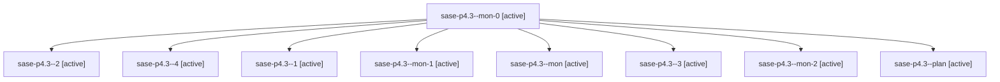

# Family: sase-p4.3

[Agent Hoods](../README.md) / [bbugyi200](../users/bbugyi200/README.md) / [athena](../users/bbugyi200/machines/athena/README.md) / [sase-p4](../users/bbugyi200/machines/athena/hoods/sase-p4/README.md) / sase-p4.3

Owner: `bbugyi200.athena` · Hood: `sase-p4` · Members: 9 · Bead: [sase-p4.3](https://github.com/sase-org/sase--beads/blob/main/pages/sase-p4/sase-p4.3.md)

## Lineage

The diagram is an optional enhancement; the ordered table below contains the same lineage in accessible text.

| Role | Agent | State | Model / provider | Timing | Commits | Prompt | Chat |
|---|---|---|---|---|---:|---|---|
| mon-0 | sase-p4.3--mon-0 | active | grok-4.6 / grok | 2026-08-18T00:58:43.758616+00:00 | 0 | — | — |
| 2 | sase-p4.3--2 | active | grok-4.6 / grok | 2026-08-18T01:34:50.659321+00:00 | 0 | [Prompt](../agents/bbugyi200.athena.sase-p4.3--2/prompt.md) | [Chat](../agents/bbugyi200.athena.sase-p4.3--2/chat.md) |
| 4 | sase-p4.3--4 | active | grok-4.6 / grok | 2026-08-18T02:50:36.684954+00:00 | 0 | [Prompt](../agents/bbugyi200.athena.sase-p4.3--4/prompt.md) | — |
| 1 | sase-p4.3--1 | active | grok-4.6 / grok | 2026-08-18T00:49:00.064206+00:00 | 0 | [Prompt](../agents/bbugyi200.athena.sase-p4.3--1/prompt.md) | [Chat](../agents/bbugyi200.athena.sase-p4.3--1/chat.md) |
| mon-1 | sase-p4.3--mon-1 | active | grok-4.6 / grok | 2026-08-18T01:54:40.763050+00:00 | 0 | — | — |
| mon | sase-p4.3--mon | active | grok-4.6 / grok | 2026-08-18T00:46:22.159922+00:00 | 0 | — | — |
| 3 | sase-p4.3--3 | active | grok-4.6 / grok | 2026-08-18T02:17:49.378001+00:00 | 0 | [Prompt](../agents/bbugyi200.athena.sase-p4.3--3/prompt.md) | [Chat](../agents/bbugyi200.athena.sase-p4.3--3/chat.md) |
| mon-2 | sase-p4.3--mon-2 | active | grok-4.6 / grok | 2026-08-18T02:27:10.860991+00:00 | 0 | — | — |
| plan | sase-p4.3--plan | active | grok-4.6 / grok | 2026-08-18T00:26:19.832784+00:00 | 0 | [Prompt](../agents/bbugyi200.athena.sase-p4.3--plan/prompt.md) | [Chat](../agents/bbugyi200.athena.sase-p4.3--plan/chat.md) |

## Commits

| Role | Repo | Commit | Subject | Committed |
|---|---|---|---|---|
| — | sase | [`d04a5d7`](https://github.com/sase-org/sase/commit/d04a5d7103389a147943d34b5a5453ce1f21292a) | feat(gates): register the EpicResume gate kind | 2026-08-17 23:07:38 EDT |

## Neighbors

| Agent | Relation | State |
|---|---|---|
| [sase-p4.1](bbugyi200.athena.sase-p4.1.md) (family · 5) | sase-p4 hood | active 5 |
| [sase-p4.2](../agents/bbugyi200.athena.sase-p4.2/README.md) | sase-p4 hood | active |
| [sase-p4.4](bbugyi200.athena.sase-p4.4.md) (family · 9) | sase-p4 hood | active 9 |
| [sase-p4.5](../agents/bbugyi200.athena.sase-p4.5/README.md) | sase-p4 hood | active |
| [sase-p4.land](../agents/bbugyi200.athena.sase-p4.land/README.md) | sase-p4 hood | active |
