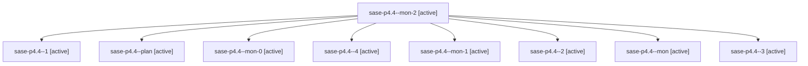

# Family: sase-p4.4

[Agent Hoods](../README.md) / [bbugyi200](../users/bbugyi200/README.md) / [athena](../users/bbugyi200/machines/athena/README.md) / [sase-p4](../users/bbugyi200/machines/athena/hoods/sase-p4/README.md) / sase-p4.4

Owner: `bbugyi200.athena` · Hood: `sase-p4` · Members: 9 · Bead: [sase-p4.4](https://github.com/sase-org/sase--beads/blob/main/pages/sase-p4/sase-p4.4.md)

## Lineage

The diagram is an optional enhancement; the ordered table below contains the same lineage in accessible text.

| Role | Agent | State | Model / provider | Timing | Commits | Prompt | Chat |
|---|---|---|---|---|---:|---|---|
| mon-2 | sase-p4.4--mon-2 | active | sonnet / claude | 2026-08-18T04:07:17.844703+00:00 | 0 | — | — |
| 1 | sase-p4.4--1 | active | sonnet / claude | 2026-08-18T03:38:05.435432+00:00 | 0 | [Prompt](../agents/bbugyi200.athena.sase-p4.4--1/prompt.md) | [Chat](../agents/bbugyi200.athena.sase-p4.4--1/chat.md) |
| plan | sase-p4.4--plan | active | sonnet / claude | 2026-08-18T03:10:19.609771+00:00 | 0 | [Prompt](../agents/bbugyi200.athena.sase-p4.4--plan/prompt.md) | [Chat](../agents/bbugyi200.athena.sase-p4.4--plan/chat.md) |
| mon-0 | sase-p4.4--mon-0 | active | sonnet / claude | 2026-08-18T03:40:16.676163+00:00 | 0 | — | — |
| 4 | sase-p4.4--4 | active | sonnet / claude | 2026-08-18T04:52:51.900235+00:00 | 0 | [Prompt](../agents/bbugyi200.athena.sase-p4.4--4/prompt.md) | — |
| mon-1 | sase-p4.4--mon-1 | active | sonnet / claude | 2026-08-18T03:44:39.712963+00:00 | 0 | — | — |
| 2 | sase-p4.4--2 | active | sonnet / claude | 2026-08-18T03:42:59.291714+00:00 | 0 | [Prompt](../agents/bbugyi200.athena.sase-p4.4--2/prompt.md) | [Chat](../agents/bbugyi200.athena.sase-p4.4--2/chat.md) |
| mon | sase-p4.4--mon | active | sonnet / claude | 2026-08-18T03:37:08.621625+00:00 | 0 | — | — |
| 3 | sase-p4.4--3 | active | sonnet / claude | 2026-08-18T04:04:21.176010+00:00 | 0 | [Prompt](../agents/bbugyi200.athena.sase-p4.4--3/prompt.md) | [Chat](../agents/bbugyi200.athena.sase-p4.4--3/chat.md) |

## Commits

| Role | Repo | Commit | Subject | Committed |
|---|---|---|---|---|
| — | sase | [`11fddd5`](https://github.com/sase-org/sase/commit/11fddd525d0379a5052ec1b7eba60e22ad907fe1) | feat(bead): add the epic\_resume chop and its feature flag | 2026-08-18 00:58:27 EDT |

## Neighbors

| Agent | Relation | State |
|---|---|---|
| [sase-p4.1](bbugyi200.athena.sase-p4.1.md) (family · 5) | sase-p4 hood | active 5 |
| [sase-p4.2](../agents/bbugyi200.athena.sase-p4.2/README.md) | sase-p4 hood | active |
| [sase-p4.3](bbugyi200.athena.sase-p4.3.md) (family · 9) | sase-p4 hood | active 9 |
| [sase-p4.5](../agents/bbugyi200.athena.sase-p4.5/README.md) | sase-p4 hood | active |
| [sase-p4.land](../agents/bbugyi200.athena.sase-p4.land/README.md) | sase-p4 hood | active |
