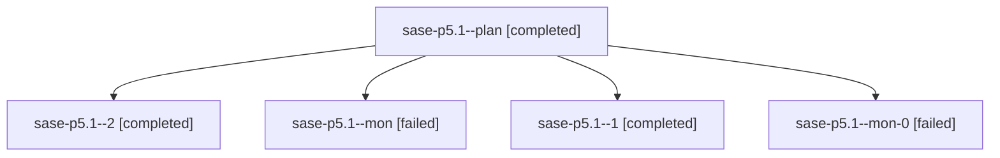

# Family: sase-p5.1

[Agent Hoods](../README.md) / [bbugyi200](../users/bbugyi200/README.md) / [athena](../users/bbugyi200/machines/athena/README.md) / [sase-p5](../users/bbugyi200/machines/athena/hoods/sase-p5/README.md) / sase-p5.1

Owner: `bbugyi200.athena` · Hood: `sase-p5` · Members: 5 · Bead: [sase-p5.1](https://github.com/sase-org/sase--beads/blob/main/pages/sase-p5/sase-p5.1.md)

## Lineage

The diagram is an optional enhancement; the ordered table below contains the same lineage in accessible text.

| Role | Agent | State | Model / provider | Timing | Commits | Prompt | Chat |
|---|---|---|---|---|---:|---|---|
| plan | sase-p5.1--plan | completed | sonnet / claude | 2026-08-17T22:56:36.942727+00:00 | 0 | [Prompt](../agents/bbugyi200.athena.sase-p5.1--plan/prompt.md) | [Chat](../agents/bbugyi200.athena.sase-p5.1--plan/chat.md) |
| 2 | sase-p5.1--2 | completed | sonnet / claude | 2026-08-17T23:40:13.504765+00:00 | [1](../agents/bbugyi200.athena.sase-p5.1--2/README.md#commits) | [Prompt](../agents/bbugyi200.athena.sase-p5.1--2/prompt.md) | [Chat](../agents/bbugyi200.athena.sase-p5.1--2/chat.md) |
| mon | sase-p5.1--mon | failed | sonnet / claude | 2026-08-17T23:21:58.636426+00:00 | 0 | — | [Chat](../agents/bbugyi200.athena.sase-p5.1--mon/chat.md) |
| 1 | sase-p5.1--1 | completed | sonnet / claude | 2026-08-17T23:24:16.092013+00:00 | 0 | [Prompt](../agents/bbugyi200.athena.sase-p5.1--1/prompt.md) | [Chat](../agents/bbugyi200.athena.sase-p5.1--1/chat.md) |
| mon-0 | sase-p5.1--mon-0 | failed | sonnet / claude | 2026-08-17T23:29:02.273948+00:00 | 0 | — | [Chat](../agents/bbugyi200.athena.sase-p5.1--mon-0/chat.md) |

## Commits

| Role | Repo | Commit | Subject | Committed |
|---|---|---|---|---|
| 2 | sase | [`22e5444`](https://github.com/sase-org/sase/commit/22e5444bf29cdb1b964831c02678155911463689) | fix(commit): restamp dropped SASE footer tags on resumed commits | 2026-08-17 19:47:33 EDT |

## Neighbors

| Agent | Relation | State |
|---|---|---|
| [sase-p5.2](../agents/bbugyi200.athena.sase-p5.2/README.md) | sase-p5 hood | completed |
| [sase-p5.3](../agents/bbugyi200.athena.sase-p5.3/README.md) | sase-p5 hood | dismissed |
| [sase-p5.4](bbugyi200.athena.sase-p5.4.md) (family · 3) | sase-p5 hood | completed 2, failed 1 |
| [sase-p5.4](../agents/bbugyi200.athena.sase-p5.4/README.md) | sase-p5 hood | waiting |
| [sase-p5.5](../agents/bbugyi200.athena.sase-p5.5/README.md) | sase-p5 hood | completed |
| [sase-p5.land](../agents/bbugyi200.athena.sase-p5.land/README.md) | sase-p5 hood | active |
