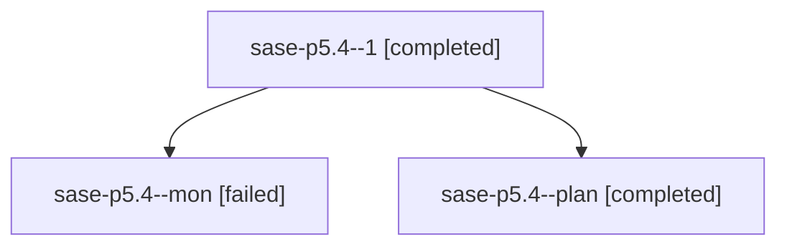

# Family: sase-p5.4

[Agent Hoods](../README.md) / [bbugyi200](../users/bbugyi200/README.md) / [athena](../users/bbugyi200/machines/athena/README.md) / [sase-p5](../users/bbugyi200/machines/athena/hoods/sase-p5/README.md) / sase-p5.4

Owner: `bbugyi200.athena` · Hood: `sase-p5` · Members: 3 · Bead: [sase-p5.4](https://github.com/sase-org/sase--beads/blob/main/pages/sase-p5/sase-p5.4.md)

## Lineage

The diagram is an optional enhancement; the ordered table below contains the same lineage in accessible text.

| Role | Agent | State | Model / provider | Timing | Commits | Prompt | Chat |
|---|---|---|---|---|---:|---|---|
| 1 | sase-p5.4--1 | completed | sonnet / claude | 2026-08-18T10:46:14.417095+00:00 | [1](../agents/bbugyi200.athena.sase-p5.4--1/README.md#commits) | [Prompt](../agents/bbugyi200.athena.sase-p5.4--1/prompt.md) | [Chat](../agents/bbugyi200.athena.sase-p5.4--1/chat.md) |
| mon | sase-p5.4--mon | failed | sonnet / claude | 2026-08-18T10:38:07.060711+00:00 | 0 | — | [Chat](../agents/bbugyi200.athena.sase-p5.4--mon/chat.md) |
| plan | sase-p5.4--plan | completed | sonnet / claude | 2026-08-18T10:14:06.760421+00:00 | 0 | [Prompt](../agents/bbugyi200.athena.sase-p5.4--plan/prompt.md) | [Chat](../agents/bbugyi200.athena.sase-p5.4--plan/chat.md) |

## Commits

| Role | Repo | Commit | Subject | Committed |
|---|---|---|---|---|
| 1 | sase | [`aaa09eb`](https://github.com/sase-org/sase/commit/aaa09eba9f945ac86cfd9faca2aae2e1d72159e4) | fix(llm\_provider): exempt shared-clone races from the discarded-work guard | 2026-08-18 10:48:02 UTC |

## Neighbors

| Agent | Relation | State |
|---|---|---|
| [sase-p5.1](bbugyi200.athena.sase-p5.1.md) (family · 5) | sase-p5 hood | completed 3, failed 2 |
| [sase-p5.2](../agents/bbugyi200.athena.sase-p5.2/README.md) | sase-p5 hood | completed |
| [sase-p5.3](../agents/bbugyi200.athena.sase-p5.3/README.md) | sase-p5 hood | dismissed |
| [sase-p5.5](../agents/bbugyi200.athena.sase-p5.5/README.md) | sase-p5 hood | completed |
| [sase-p5.land](../agents/bbugyi200.athena.sase-p5.land/README.md) | sase-p5 hood | active |
