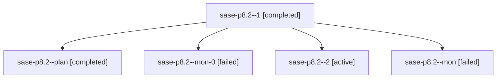

# Family: sase-p8.2

[Agent Hoods](../README.md) / [bbugyi200](../users/bbugyi200/README.md) / [athena](../users/bbugyi200/machines/athena/README.md) / [sase-p8](../users/bbugyi200/machines/athena/hoods/sase-p8/README.md) / sase-p8.2

Owner: `bbugyi200.athena` · Hood: `sase-p8` · Members: 5 · Bead: [sase-p8.2](https://github.com/sase-org/sase--beads/blob/main/pages/sase-p8/sase-p8.2.md)

## Lineage

The diagram is an optional enhancement; the ordered table below contains the same lineage in accessible text.

| Role | Agent | State | Model / provider | Timing | Commits | Prompt | Chat |
|---|---|---|---|---|---:|---|---|
| 1 | sase-p8.2--1 | completed | grok-4.6 / grok | 2026-08-18T00:38:59.790168+00:00 | 0 | [Prompt](../agents/bbugyi200.athena.sase-p8.2--1/prompt.md) | [Chat](../agents/bbugyi200.athena.sase-p8.2--1/chat.md) |
| plan | sase-p8.2--plan | completed | grok-4.6 / grok | 2026-08-17T23:03:53.002403+00:00 | 0 | [Prompt](../agents/bbugyi200.athena.sase-p8.2--plan/prompt.md) | [Chat](../agents/bbugyi200.athena.sase-p8.2--plan/chat.md) |
| mon-0 | sase-p8.2--mon-0 | failed | grok-4.6 / grok | 2026-08-18T00:48:34.597146+00:00 | 0 | — | [Chat](../agents/bbugyi200.athena.sase-p8.2--mon-0/chat.md) |
| 2 | sase-p8.2--2 | active | grok-4.6 / grok | 2026-08-18T00:51:19.132136+00:00 | 0 | [Prompt](../agents/bbugyi200.athena.sase-p8.2--2/prompt.md) | — |
| mon | sase-p8.2--mon | failed | grok-4.6 / grok | 2026-08-17T23:53:32.490713+00:00 | 0 | — | [Chat](../agents/bbugyi200.athena.sase-p8.2--mon/chat.md) |

## Neighbors

| Agent | Relation | State |
|---|---|---|
| [sase-p8.1](../agents/bbugyi200.athena.sase-p8.1/README.md) | sase-p8 hood | completed |
| [sase-p8.3](../agents/bbugyi200.athena.sase-p8.3/README.md) | sase-p8 hood | completed |
| [sase-p8.4](../agents/bbugyi200.athena.sase-p8.4/README.md) | sase-p8 hood | waiting |
| [sase-p8.5](../agents/bbugyi200.athena.sase-p8.5/README.md) | sase-p8 hood | waiting |
| [sase-p8.6](../agents/bbugyi200.athena.sase-p8.6/README.md) | sase-p8 hood | waiting |
| [sase-p8.land](../agents/bbugyi200.athena.sase-p8.land/README.md) | sase-p8 hood | waiting |
