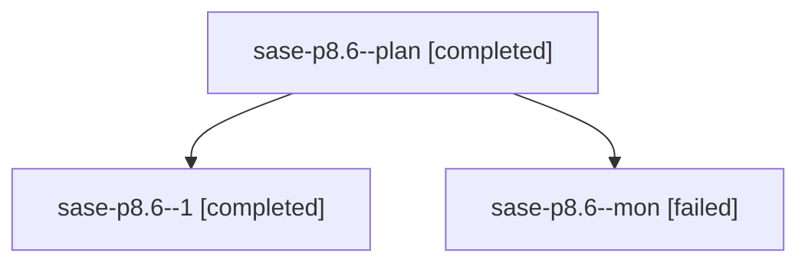

# Family: sase-p8.6

[Agent Hoods](../README.md) / [bbugyi200](../users/bbugyi200/README.md) / [athena](../users/bbugyi200/machines/athena/README.md) / [sase-p8](../users/bbugyi200/machines/athena/hoods/sase-p8/README.md) / sase-p8.6

Owner: `bbugyi200.athena` · Hood: `sase-p8` · Members: 3 · Bead: [sase-p8.6](https://github.com/sase-org/sase--beads/blob/main/pages/sase-p8/sase-p8.6.md)

## Lineage

The diagram is an optional enhancement; the ordered table below contains the same lineage in accessible text.

| Role | Agent | State | Model / provider | Timing | Commits | Prompt | Chat |
|---|---|---|---|---|---:|---|---|
| plan | sase-p8.6--plan | completed | grok-4.6 / grok | 2026-08-18T02:35:26.798231+00:00 | 0 | [Prompt](../agents/bbugyi200.athena.sase-p8.6--plan/prompt.md) | [Chat](../agents/bbugyi200.athena.sase-p8.6--plan/chat.md) |
| 1 | sase-p8.6--1 | completed | grok-4.6 / grok | 2026-08-18T03:05:56.695070+00:00 | [1](../agents/bbugyi200.athena.sase-p8.6--1/README.md#commits) | [Prompt](../agents/bbugyi200.athena.sase-p8.6--1/prompt.md) | [Chat](../agents/bbugyi200.athena.sase-p8.6--1/chat.md) |
| mon | sase-p8.6--mon | failed | grok-4.6 / grok | 2026-08-18T03:03:28.625617+00:00 | 0 | — | [Chat](../agents/bbugyi200.athena.sase-p8.6--mon/chat.md) |

## Commits

| Role | Repo | Commit | Subject | Committed |
|---|---|---|---|---|
| 1 | sase | [`c033ca4`](https://github.com/sase-org/sase/commit/c033ca4c455b7afb4a0c16e3804de41f2e34c0af) | test(pipe): add end-to-end sase pipe family exercises | 2026-08-17 23:09:33 EDT |

## Neighbors

| Agent | Relation | State |
|---|---|---|
| [sase-p8.1](../agents/bbugyi200.athena.sase-p8.1/README.md) | sase-p8 hood | completed |
| [sase-p8.2](bbugyi200.athena.sase-p8.2.md) (family · 5) | sase-p8 hood | completed 3, failed 2 |
| [sase-p8.3](../agents/bbugyi200.athena.sase-p8.3/README.md) | sase-p8 hood | completed |
| [sase-p8.4](../agents/bbugyi200.athena.sase-p8.4/README.md) | sase-p8 hood | completed |
| [sase-p8.5](../agents/bbugyi200.athena.sase-p8.5/README.md) | sase-p8 hood | completed |
| [sase-p8.land](../agents/bbugyi200.athena.sase-p8.land/README.md) | sase-p8 hood | active |
