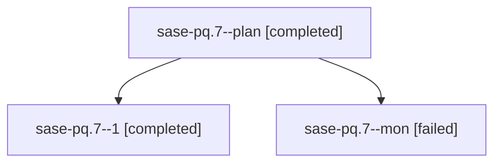

# Family: sase-pq.7

[Agent Hoods](../README.md) / [bbugyi200](../users/bbugyi200/README.md) / [athena](../users/bbugyi200/machines/athena/README.md) / [sase-pq](../users/bbugyi200/machines/athena/hoods/sase-pq/README.md) / sase-pq.7

Owner: `bbugyi200.athena` · Hood: `sase-pq` · Members: 3 · Bead: [sase-pq.7](https://github.com/sase-org/sase--beads/blob/main/pages/sase-pq/sase-pq.7.md)

## Lineage

The diagram is an optional enhancement; the ordered table below contains the same lineage in accessible text.

| Role | Agent | State | Model / provider | Timing | Commits | Prompt | Chat |
|---|---|---|---|---|---:|---|---|
| plan | sase-pq.7--plan | completed | grok-4.6 / grok | 2026-08-18T16:13:47.546320+00:00 | 0 | [Prompt](../agents/bbugyi200.athena.sase-pq.7--plan/prompt.md) | [Chat](../agents/bbugyi200.athena.sase-pq.7--plan/chat.md) |
| 1 | sase-pq.7--1 | completed | grok-4.6 / grok | 2026-08-18T16:42:49.961161+00:00 | [1](../agents/bbugyi200.athena.sase-pq.7--1/README.md#commits) | [Prompt](../agents/bbugyi200.athena.sase-pq.7--1/prompt.md) | [Chat](../agents/bbugyi200.athena.sase-pq.7--1/chat.md) |
| mon | sase-pq.7--mon | failed | grok-4.6 / grok | 2026-08-18T16:41:39.733540+00:00 | 0 | — | [Chat](../agents/bbugyi200.athena.sase-pq.7--mon/chat.md) |

## Commits

| Role | Repo | Commit | Subject | Committed |
|---|---|---|---|---|
| 1 | sase | [`50d837a`](https://github.com/sase-org/sase/commit/50d837afa887139b745b9758d8ebe66e5f311111) | test: prove typed task-bead gate chips on every surface | 2026-08-18 12:46:45 EDT |

## Neighbors

| Agent | Relation | State |
|---|---|---|
| [sase-pq.1](../agents/bbugyi200.athena.sase-pq.1/README.md) | sase-pq hood | completed |
| [sase-pq.2](../agents/bbugyi200.athena.sase-pq.2/README.md) | sase-pq hood | completed |
| [sase-pq.3](../agents/bbugyi200.athena.sase-pq.3/README.md) | sase-pq hood | completed |
| [sase-pq.4](bbugyi200.athena.sase-pq.4.md) (family · 3) | sase-pq hood | completed 2, failed 1 |
| [sase-pq.5](../agents/bbugyi200.athena.sase-pq.5/README.md) | sase-pq hood | completed |
| [sase-pq.6](../agents/bbugyi200.athena.sase-pq.6/README.md) | sase-pq hood | completed |
| [sase-pq.land](../agents/bbugyi200.athena.sase-pq.land/README.md) | sase-pq hood | active |
