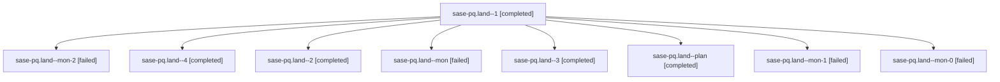

# Family: sase-pq.land

[Agent Hoods](../README.md) / [bbugyi200](../users/bbugyi200/README.md) / [athena](../users/bbugyi200/machines/athena/README.md) / [sase-pq](../users/bbugyi200/machines/athena/hoods/sase-pq/README.md) / sase-pq.land

Owner: `bbugyi200.athena` · Hood: `sase-pq` · Members: 9 · Bead: [sase-pq](https://github.com/sase-org/sase--beads/blob/main/pages/sase-pq/README.md)

## Lineage

The diagram is an optional enhancement; the ordered table below contains the same lineage in accessible text.

| Role | Agent | State | Model / provider | Timing | Commits | Prompt | Chat |
|---|---|---|---|---|---:|---|---|
| 1 | sase-pq.land--1 | completed | sonnet / claude | 2026-08-18T17:48:21.896404+00:00 | 0 | [Prompt](../agents/bbugyi200.athena.sase-pq.land--1/prompt.md) | [Chat](../agents/bbugyi200.athena.sase-pq.land--1/chat.md) |
| mon-2 | sase-pq.land--mon-2 | failed | sonnet / claude | 2026-08-18T18:41:50.339011+00:00 | 0 | — | [Chat](../agents/bbugyi200.athena.sase-pq.land--mon-2/chat.md) |
| 4 | sase-pq.land--4 | completed | sonnet / claude | 2026-08-18T19:25:48.565853+00:00 | 0 | [Prompt](../agents/bbugyi200.athena.sase-pq.land--4/prompt.md) | [Chat](../agents/bbugyi200.athena.sase-pq.land--4/chat.md) |
| 2 | sase-pq.land--2 | completed | sonnet / claude | 2026-08-18T17:51:52.737330+00:00 | 0 | [Prompt](../agents/bbugyi200.athena.sase-pq.land--2/prompt.md) | [Chat](../agents/bbugyi200.athena.sase-pq.land--2/chat.md) |
| mon | sase-pq.land--mon | failed | sonnet / claude | 2026-08-18T17:47:23.465658+00:00 | 0 | — | [Chat](../agents/bbugyi200.athena.sase-pq.land--mon/chat.md) |
| 3 | sase-pq.land--3 | completed | sonnet / claude | 2026-08-18T18:39:25.153576+00:00 | 0 | [Prompt](../agents/bbugyi200.athena.sase-pq.land--3/prompt.md) | [Chat](../agents/bbugyi200.athena.sase-pq.land--3/chat.md) |
| plan | sase-pq.land--plan | completed | sonnet / claude | 2026-08-18T16:47:53.115068+00:00 | 0 | [Prompt](../agents/bbugyi200.athena.sase-pq.land--plan/prompt.md) | [Chat](../agents/bbugyi200.athena.sase-pq.land--plan/chat.md) |
| mon-1 | sase-pq.land--mon-1 | failed | sonnet / claude | 2026-08-18T17:53:51.354234+00:00 | 0 | — | [Chat](../agents/bbugyi200.athena.sase-pq.land--mon-1/chat.md) |
| mon-0 | sase-pq.land--mon-0 | failed | sonnet / claude | 2026-08-18T17:50:01.604776+00:00 | 0 | — | [Chat](../agents/bbugyi200.athena.sase-pq.land--mon-0/chat.md) |

## Neighbors

| Agent | Relation | State |
|---|---|---|
| [sase-pq.1](../agents/bbugyi200.athena.sase-pq.1/README.md) | sase-pq hood | completed |
| [sase-pq.2](../agents/bbugyi200.athena.sase-pq.2/README.md) | sase-pq hood | completed |
| [sase-pq.3](../agents/bbugyi200.athena.sase-pq.3/README.md) | sase-pq hood | completed |
| [sase-pq.4](bbugyi200.athena.sase-pq.4.md) (family · 3) | sase-pq hood | completed 2, failed 1 |
| [sase-pq.5](../agents/bbugyi200.athena.sase-pq.5/README.md) | sase-pq hood | completed |
| [sase-pq.6](../agents/bbugyi200.athena.sase-pq.6/README.md) | sase-pq hood | completed |
| [sase-pq.7](bbugyi200.athena.sase-pq.7.md) (family · 3) | sase-pq hood | completed 2, failed 1 |
