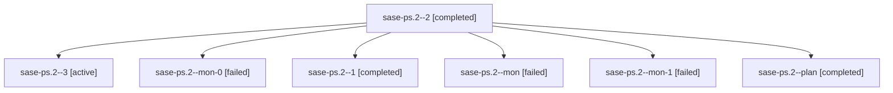

# Family: sase-ps.2

[Agent Hoods](../README.md) / [bbugyi200](../users/bbugyi200/README.md) / [athena](../users/bbugyi200/machines/athena/README.md) / [sase-ps](../users/bbugyi200/machines/athena/hoods/sase-ps/README.md) / sase-ps.2

Owner: `bbugyi200.athena` · Hood: `sase-ps` · Members: 7 · Bead: [sase-ps.2](https://github.com/sase-org/sase--beads/blob/main/pages/sase-ps/sase-ps.2.md)

## Lineage

The diagram is an optional enhancement; the ordered table below contains the same lineage in accessible text.

| Role | Agent | State | Model / provider | Timing | Commits | Prompt | Chat |
|---|---|---|---|---|---:|---|---|
| 2 | sase-ps.2--2 | completed | sonnet / claude | 2026-08-18T15:51:33.122836+00:00 | 0 | [Prompt](../agents/bbugyi200.athena.sase-ps.2--2/prompt.md) | [Chat](../agents/bbugyi200.athena.sase-ps.2--2/chat.md) |
| 3 | sase-ps.2--3 | active | sonnet / claude | 2026-08-18T16:04:27.172560+00:00 | 0 | [Prompt](../agents/bbugyi200.athena.sase-ps.2--3/prompt.md) | — |
| mon-0 | sase-ps.2--mon-0 | failed | sonnet / claude | 2026-08-18T15:48:33.669264+00:00 | 0 | — | [Chat](../agents/bbugyi200.athena.sase-ps.2--mon-0/chat.md) |
| 1 | sase-ps.2--1 | completed | sonnet / claude | 2026-08-18T15:47:22.865435+00:00 | 0 | [Prompt](../agents/bbugyi200.athena.sase-ps.2--1/prompt.md) | [Chat](../agents/bbugyi200.athena.sase-ps.2--1/chat.md) |
| mon | sase-ps.2--mon | failed | sonnet / claude | 2026-08-18T15:44:57.645362+00:00 | 0 | — | [Chat](../agents/bbugyi200.athena.sase-ps.2--mon/chat.md) |
| mon-1 | sase-ps.2--mon-1 | failed | sonnet / claude | 2026-08-18T15:54:13.503171+00:00 | 0 | — | [Chat](../agents/bbugyi200.athena.sase-ps.2--mon-1/chat.md) |
| plan | sase-ps.2--plan | completed | sonnet / claude | 2026-08-18T15:04:38.428262+00:00 | 0 | [Prompt](../agents/bbugyi200.athena.sase-ps.2--plan/prompt.md) | [Chat](../agents/bbugyi200.athena.sase-ps.2--plan/chat.md) |

## Neighbors

| Agent | Relation | State |
|---|---|---|
| [sase-ps.1](../agents/bbugyi200.athena.sase-ps.1/README.md) | sase-ps hood | completed |
| [sase-ps.3](../agents/bbugyi200.athena.sase-ps.3/README.md) | sase-ps hood | active |
| [sase-ps.4](../agents/bbugyi200.athena.sase-ps.4/README.md) | sase-ps hood | waiting |
| [sase-ps.land](../agents/bbugyi200.athena.sase-ps.land/README.md) | sase-ps hood | waiting |
