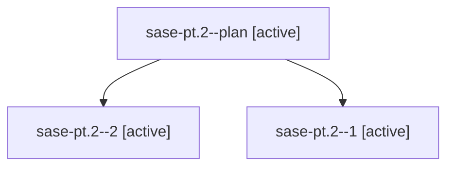

# Family: sase-pt.2

[Agent Hoods](../README.md) / [bbugyi200](../users/bbugyi200/README.md) / [athena](../users/bbugyi200/machines/athena/README.md) / [sase-pt](../users/bbugyi200/machines/athena/hoods/sase-pt/README.md) / sase-pt.2

Owner: `bbugyi200.athena` · Hood: `sase-pt` · Members: 3 · Bead: [sase-pt.2](https://github.com/sase-org/sase--beads/blob/main/pages/sase-pt/sase-pt.2.md)

## Lineage

The diagram is an optional enhancement; the ordered table below contains the same lineage in accessible text.

| Role | Agent | State | Model / provider | Timing | Commits | Prompt | Chat |
|---|---|---|---|---|---:|---|---|
| plan | sase-pt.2--plan | active | grok-4.6 / grok | 2026-08-18T14:54:56.246447+00:00 | 0 | [Prompt](../agents/bbugyi200.athena.sase-pt.2--plan/prompt.md) | [Chat](../agents/bbugyi200.athena.sase-pt.2--plan/chat.md) |
| 2 | sase-pt.2--2 | active | grok-4.6 / grok | 2026-08-18T15:04:43.654060+00:00 | 0 | — | — |
| 1 | sase-pt.2--1 | active | sonnet / claude | 2026-08-18T15:01:43.718352+00:00 | 0 | — | [Chat](../agents/bbugyi200.athena.sase-pt.2--1/chat.md) |

## Neighbors

| Agent | Relation | State |
|---|---|---|
| [sase-pt.1](bbugyi200.athena.sase-pt.1.md) (family · 4) | sase-pt hood | completed 3, failed 1 |
| [sase-pt.3](../agents/bbugyi200.athena.sase-pt.3/README.md) | sase-pt hood | waiting |
| [sase-pt.4](../agents/bbugyi200.athena.sase-pt.4/README.md) | sase-pt hood | waiting |
| [sase-pt.land](../agents/bbugyi200.athena.sase-pt.land/README.md) | sase-pt hood | waiting |
