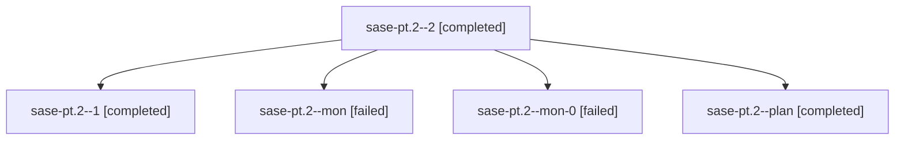

# Family: sase-pt.2

[Agent Hoods](../README.md) / [bbugyi200](../users/bbugyi200/README.md) / [athena](../users/bbugyi200/machines/athena/README.md) / [sase-pt](../users/bbugyi200/machines/athena/hoods/sase-pt/README.md) / sase-pt.2

Owner: `bbugyi200.athena` · Hood: `sase-pt` · Members: 5 · Bead: [sase-pt.2](https://github.com/sase-org/sase--beads/blob/main/pages/sase-pt/sase-pt.2.md)

## Lineage

The diagram is an optional enhancement; the ordered table below contains the same lineage in accessible text.

| Role | Agent | State | Model / provider | Timing | Commits | Prompt | Chat |
|---|---|---|---|---|---:|---|---|
| 2 | sase-pt.2--2 | completed | grok-4.6 / grok | 2026-08-18T16:19:10.812586+00:00 | 0 | [Prompt](../agents/bbugyi200.athena.sase-pt.2--2/prompt.md) | [Chat](../agents/bbugyi200.athena.sase-pt.2--2/chat.md) |
| 1 | sase-pt.2--1 | completed | grok-4.6 / grok | 2026-08-18T15:58:55.449494+00:00 | 0 | [Prompt](../agents/bbugyi200.athena.sase-pt.2--1/prompt.md) | [Chat](../agents/bbugyi200.athena.sase-pt.2--1/chat.md) |
| mon | sase-pt.2--mon | failed | grok-4.6 / grok | 2026-08-18T15:55:34.175589+00:00 | 0 | — | [Chat](../agents/bbugyi200.athena.sase-pt.2--mon/chat.md) |
| mon-0 | sase-pt.2--mon-0 | failed | grok-4.6 / grok | 2026-08-18T16:14:04.824822+00:00 | 0 | — | [Chat](../agents/bbugyi200.athena.sase-pt.2--mon-0/chat.md) |
| plan | sase-pt.2--plan | completed | grok-4.6 / grok | 2026-08-18T15:47:46.173532+00:00 | 0 | [Prompt](../agents/bbugyi200.athena.sase-pt.2--plan/prompt.md) | [Chat](../agents/bbugyi200.athena.sase-pt.2--plan/chat.md) |

## Neighbors

| Agent | Relation | State |
|---|---|---|
| [sase-pt.1](bbugyi200.athena.sase-pt.1.md) (family · 4) | sase-pt hood | completed 3, failed 1 |
| [sase-pt.2--4--1](../agents/bbugyi200.athena.sase-pt.2--4--1/README.md) | sase-pt hood | dismissed |
| [sase-pt.3](bbugyi200.athena.sase-pt.3.md) (family · 3) | sase-pt hood | completed 2, failed 1 |
| [sase-pt.4](../agents/bbugyi200.athena.sase-pt.4/README.md) | sase-pt hood | completed |
| [sase-pt.land](../agents/bbugyi200.athena.sase-pt.land/README.md) | sase-pt hood | completed |
