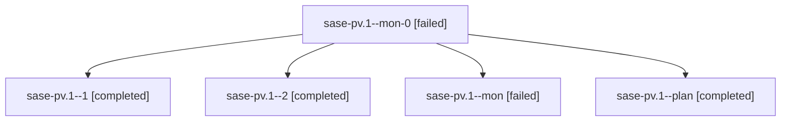

# Family: sase-pv.1

[Agent Hoods](../README.md) / [bbugyi200](../users/bbugyi200/README.md) / [athena](../users/bbugyi200/machines/athena/README.md) / [sase-pv](../users/bbugyi200/machines/athena/hoods/sase-pv/README.md) / sase-pv.1

Owner: `bbugyi200.athena` · Hood: `sase-pv` · Members: 5 · Bead: [sase-pv.1](https://github.com/sase-org/sase--beads/blob/main/pages/sase-pv/sase-pv.1.md)

## Lineage

The diagram is an optional enhancement; the ordered table below contains the same lineage in accessible text.

| Role | Agent | State | Model / provider | Timing | Commits | Prompt | Chat |
|---|---|---|---|---|---:|---|---|
| mon-0 | sase-pv.1--mon-0 | failed | grok-4.6 / grok | 2026-08-18T15:54:36.433514+00:00 | 0 | — | [Chat](../agents/bbugyi200.athena.sase-pv.1--mon-0/chat.md) |
| 1 | sase-pv.1--1 | completed | grok-4.6 / grok | 2026-08-18T15:48:38.176568+00:00 | 0 | [Prompt](../agents/bbugyi200.athena.sase-pv.1--1/prompt.md) | [Chat](../agents/bbugyi200.athena.sase-pv.1--1/chat.md) |
| 2 | sase-pv.1--2 | completed | grok-4.6 / grok | 2026-08-18T16:21:15.755078+00:00 | 0 | [Prompt](../agents/bbugyi200.athena.sase-pv.1--2/prompt.md) | [Chat](../agents/bbugyi200.athena.sase-pv.1--2/chat.md) |
| mon | sase-pv.1--mon | failed | grok-4.6 / grok | 2026-08-18T15:34:42.116355+00:00 | 0 | — | [Chat](../agents/bbugyi200.athena.sase-pv.1--mon/chat.md) |
| plan | sase-pv.1--plan | completed | grok-4.6 / grok | 2026-08-18T15:28:42.521651+00:00 | 0 | [Prompt](../agents/bbugyi200.athena.sase-pv.1--plan/prompt.md) | [Chat](../agents/bbugyi200.athena.sase-pv.1--plan/chat.md) |

## Commits

| Role | Repo | Commit | Subject | Committed |
|---|---|---|---|---|
| — | sase | [`24ce7e0`](https://github.com/sase-org/sase/commit/24ce7e0569ed94368acbbe518607d29594753bbe) | test: accept flag as a claimable task-type slug | 2026-08-18 16:29:18 UTC |

## Neighbors

| Agent | Relation | State |
|---|---|---|
| [sase-pv.2](../agents/bbugyi200.athena.sase-pv.2/README.md) | sase-pv hood | completed |
| [sase-pv.3](../agents/bbugyi200.athena.sase-pv.3/README.md) | sase-pv hood | completed |
| [sase-pv.4](../agents/bbugyi200.athena.sase-pv.4/README.md) | sase-pv hood | completed |
| [sase-pv.5](../agents/bbugyi200.athena.sase-pv.5/README.md) | sase-pv hood | completed |
| [sase-pv.6](../agents/bbugyi200.athena.sase-pv.6/README.md) | sase-pv hood | completed |
| [sase-pv.7](../agents/bbugyi200.athena.sase-pv.7/README.md) | sase-pv hood | completed |
| [sase-pv.7.f0](../agents/bbugyi200.athena.sase-pv.7.f0/README.md) | sase-pv hood | completed |
| [sase-pv.8](bbugyi200.athena.sase-pv.8.md) (family · 3) | sase-pv hood | completed 2, failed 1 |
| [sase-pv.9](../agents/bbugyi200.athena.sase-pv.9/README.md) | sase-pv hood | completed |
| [sase-pv.land](bbugyi200.athena.sase-pv.land.md) (family · 7) | sase-pv hood | active 1, completed 3, failed 3 |
