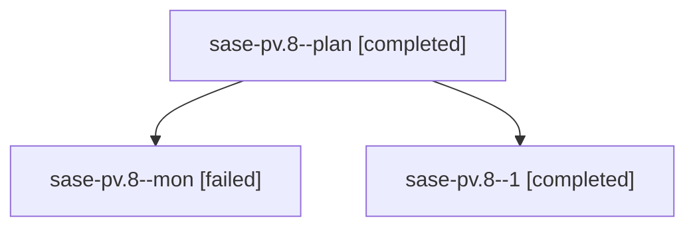

# Family: sase-pv.8

[Agent Hoods](../README.md) / [bbugyi200](../users/bbugyi200/README.md) / [athena](../users/bbugyi200/machines/athena/README.md) / [sase-pv](../users/bbugyi200/machines/athena/hoods/sase-pv/README.md) / sase-pv.8

Owner: `bbugyi200.athena` · Hood: `sase-pv` · Members: 3 · Bead: [sase-pv.8](https://github.com/sase-org/sase--beads/blob/main/pages/sase-pv/sase-pv.8.md)

## Lineage

The diagram is an optional enhancement; the ordered table below contains the same lineage in accessible text.

| Role | Agent | State | Model / provider | Timing | Commits | Prompt | Chat |
|---|---|---|---|---|---:|---|---|
| plan | sase-pv.8--plan | completed | grok-4.6 / grok | 2026-08-18T22:30:48.023046+00:00 | 0 | [Prompt](../agents/bbugyi200.athena.sase-pv.8--plan/prompt.md) | [Chat](../agents/bbugyi200.athena.sase-pv.8--plan/chat.md) |
| mon | sase-pv.8--mon | failed | grok-4.6 / grok | 2026-08-18T23:44:11.115742+00:00 | 0 | — | [Chat](../agents/bbugyi200.athena.sase-pv.8--mon/chat.md) |
| 1 | sase-pv.8--1 | completed | grok-4.6 / grok | 2026-08-19T00:02:57.467328+00:00 | [1](../agents/bbugyi200.athena.sase-pv.8--1/README.md#commits) | [Prompt](../agents/bbugyi200.athena.sase-pv.8--1/prompt.md) | [Chat](../agents/bbugyi200.athena.sase-pv.8--1/chat.md) |

## Commits

| Role | Repo | Commit | Subject | Committed |
|---|---|---|---|---|
| 1 | sase | [`a317a2e`](https://github.com/sase-org/sase/commit/a317a2e359e8dfc1f8428473a7ebbdd106a94b0f) | feat(bead)!: delete the flag issue type | 2026-08-18 20:18:15 EDT |

## Neighbors

| Agent | Relation | State |
|---|---|---|
| [sase-pv.1](bbugyi200.athena.sase-pv.1.md) (family · 5) | sase-pv hood | completed 3, failed 2 |
| [sase-pv.2](../agents/bbugyi200.athena.sase-pv.2/README.md) | sase-pv hood | completed |
| [sase-pv.3](../agents/bbugyi200.athena.sase-pv.3/README.md) | sase-pv hood | completed |
| [sase-pv.4](../agents/bbugyi200.athena.sase-pv.4/README.md) | sase-pv hood | completed |
| [sase-pv.5](../agents/bbugyi200.athena.sase-pv.5/README.md) | sase-pv hood | completed |
| [sase-pv.6](../agents/bbugyi200.athena.sase-pv.6/README.md) | sase-pv hood | completed |
| [sase-pv.7](../agents/bbugyi200.athena.sase-pv.7/README.md) | sase-pv hood | completed |
| [sase-pv.7.f0](../agents/bbugyi200.athena.sase-pv.7.f0/README.md) | sase-pv hood | completed |
| [sase-pv.9](../agents/bbugyi200.athena.sase-pv.9/README.md) | sase-pv hood | completed |
| [sase-pv.land](bbugyi200.athena.sase-pv.land.md) (family · 2) | sase-pv hood | active 1, completed 1 |
