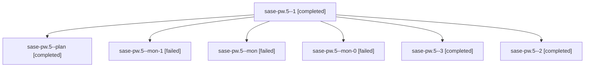

# Family: sase-pw.5

[Agent Hoods](../README.md) / [bbugyi200](../users/bbugyi200/README.md) / [athena](../users/bbugyi200/machines/athena/README.md) / [sase-pw](../users/bbugyi200/machines/athena/hoods/sase-pw/README.md) / sase-pw.5

Owner: `bbugyi200.athena` · Hood: `sase-pw` · Members: 7 · Bead: [sase-pw.5](https://github.com/sase-org/sase--beads/blob/main/pages/sase-pw/sase-pw.5.md)

## Lineage

The diagram is an optional enhancement; the ordered table below contains the same lineage in accessible text.

| Role | Agent | State | Model / provider | Timing | Commits | Prompt | Chat |
|---|---|---|---|---|---:|---|---|
| 1 | sase-pw.5--1 | completed | grok-4.6 / grok | 2026-08-18T19:01:59.433369+00:00 | 0 | [Prompt](../agents/bbugyi200.athena.sase-pw.5--1/prompt.md) | [Chat](../agents/bbugyi200.athena.sase-pw.5--1/chat.md) |
| plan | sase-pw.5--plan | completed | grok-4.6 / grok | 2026-08-18T18:06:43.478529+00:00 | 0 | [Prompt](../agents/bbugyi200.athena.sase-pw.5--plan/prompt.md) | [Chat](../agents/bbugyi200.athena.sase-pw.5--plan/chat.md) |
| mon-1 | sase-pw.5--mon-1 | failed | grok-4.6 / grok | 2026-08-18T19:21:56.742042+00:00 | 0 | — | [Chat](../agents/bbugyi200.athena.sase-pw.5--mon-1/chat.md) |
| mon | sase-pw.5--mon | failed | grok-4.6 / grok | 2026-08-18T18:37:58.896492+00:00 | 0 | — | [Chat](../agents/bbugyi200.athena.sase-pw.5--mon/chat.md) |
| mon-0 | sase-pw.5--mon-0 | failed | grok-4.6 / grok | 2026-08-18T19:12:32.834786+00:00 | 0 | — | [Chat](../agents/bbugyi200.athena.sase-pw.5--mon-0/chat.md) |
| 3 | sase-pw.5--3 | completed | grok-4.6 / grok | 2026-08-18T19:42:01.886112+00:00 | 0 | [Prompt](../agents/bbugyi200.athena.sase-pw.5--3/prompt.md) | [Chat](../agents/bbugyi200.athena.sase-pw.5--3/chat.md) |
| 2 | sase-pw.5--2 | completed | grok-4.6 / grok | 2026-08-18T19:15:28.388426+00:00 | 0 | [Prompt](../agents/bbugyi200.athena.sase-pw.5--2/prompt.md) | [Chat](../agents/bbugyi200.athena.sase-pw.5--2/chat.md) |

## Neighbors

| Agent | Relation | State |
|---|---|---|
| [sase-pw.1](../agents/bbugyi200.athena.sase-pw.1/README.md) | sase-pw hood | completed |
| [sase-pw.2](../agents/bbugyi200.athena.sase-pw.2/README.md) | sase-pw hood | completed |
| [sase-pw.3](../agents/bbugyi200.athena.sase-pw.3/README.md) | sase-pw hood | completed |
| [sase-pw.4](../agents/bbugyi200.athena.sase-pw.4/README.md) | sase-pw hood | completed |
| [sase-pw.6](../agents/bbugyi200.athena.sase-pw.6/README.md) | sase-pw hood | active |
| [sase-pw.7](bbugyi200.athena.sase-pw.7.md) (family · 5) | sase-pw hood | active 1, completed 2, failed 2 |
| [sase-pw.8](bbugyi200.athena.sase-pw.8.md) (family · 5) | sase-pw hood | active 1, completed 2, failed 2 |
| [sase-pw.9](../agents/bbugyi200.athena.sase-pw.9/README.md) | sase-pw hood | waiting |
| [sase-pw.land](../agents/bbugyi200.athena.sase-pw.land/README.md) | sase-pw hood | waiting |
