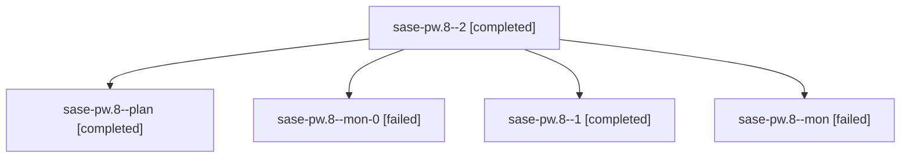

# Family: sase-pw.8

[Agent Hoods](../README.md) / [bbugyi200](../users/bbugyi200/README.md) / [athena](../users/bbugyi200/machines/athena/README.md) / [sase-pw](../users/bbugyi200/machines/athena/hoods/sase-pw/README.md) / sase-pw.8

Owner: `bbugyi200.athena` · Hood: `sase-pw` · Members: 5 · Bead: [sase-pw.8](https://github.com/sase-org/sase--beads/blob/main/pages/sase-pw/sase-pw.8.md)

## Lineage

The diagram is an optional enhancement; the ordered table below contains the same lineage in accessible text.

| Role | Agent | State | Model / provider | Timing | Commits | Prompt | Chat |
|---|---|---|---|---|---:|---|---|
| 2 | sase-pw.8--2 | completed | grok-4.6 / grok | 2026-08-18T19:47:09.867120+00:00 | 0 | [Prompt](../agents/bbugyi200.athena.sase-pw.8--2/prompt.md) | [Chat](../agents/bbugyi200.athena.sase-pw.8--2/chat.md) |
| plan | sase-pw.8--plan | completed | grok-4.6 / grok | 2026-08-18T18:13:28.015946+00:00 | 0 | [Prompt](../agents/bbugyi200.athena.sase-pw.8--plan/prompt.md) | [Chat](../agents/bbugyi200.athena.sase-pw.8--plan/chat.md) |
| mon-0 | sase-pw.8--mon-0 | failed | grok-4.6 / grok | 2026-08-18T19:34:01.452978+00:00 | 0 | — | [Chat](../agents/bbugyi200.athena.sase-pw.8--mon-0/chat.md) |
| 1 | sase-pw.8--1 | completed | grok-4.6 / grok | 2026-08-18T19:23:52.097192+00:00 | 0 | [Prompt](../agents/bbugyi200.athena.sase-pw.8--1/prompt.md) | [Chat](../agents/bbugyi200.athena.sase-pw.8--1/chat.md) |
| mon | sase-pw.8--mon | failed | grok-4.6 / grok | 2026-08-18T18:37:46.301845+00:00 | 0 | — | [Chat](../agents/bbugyi200.athena.sase-pw.8--mon/chat.md) |

## Commits

| Role | Repo | Commit | Subject | Committed |
|---|---|---|---|---|
| — | sase | [`a6e374d`](https://github.com/sase-org/sase/commit/a6e374d001efceae220525746865e3f6ac709c2f) | feat(cli): add sase project current | 2026-08-18 19:54:58 UTC |

## Neighbors

| Agent | Relation | State |
|---|---|---|
| [sase-pw.1](../agents/bbugyi200.athena.sase-pw.1/README.md) | sase-pw hood | completed |
| [sase-pw.2](../agents/bbugyi200.athena.sase-pw.2/README.md) | sase-pw hood | completed |
| [sase-pw.3](../agents/bbugyi200.athena.sase-pw.3/README.md) | sase-pw hood | completed |
| [sase-pw.4](../agents/bbugyi200.athena.sase-pw.4/README.md) | sase-pw hood | completed |
| [sase-pw.5](bbugyi200.athena.sase-pw.5.md) (family · 7) | sase-pw hood | completed 4, failed 3 |
| [sase-pw.6](../agents/bbugyi200.athena.sase-pw.6/README.md) | sase-pw hood | completed |
| [sase-pw.7](bbugyi200.athena.sase-pw.7.md) (family · 5) | sase-pw hood | completed 3, failed 2 |
| [sase-pw.9](bbugyi200.athena.sase-pw.9.md) (family · 3) | sase-pw hood | completed 2, failed 1 |
| [sase-pw.land](../agents/bbugyi200.athena.sase-pw.land/README.md) | sase-pw hood | completed |
