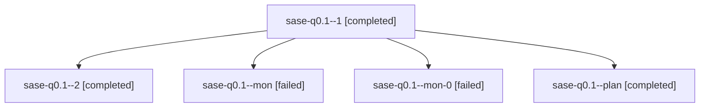

# Family: sase-q0.1

[Agent Hoods](../README.md) / [bbugyi200](../users/bbugyi200/README.md) / [athena](../users/bbugyi200/machines/athena/README.md) / [sase-q0](../users/bbugyi200/machines/athena/hoods/sase-q0/README.md) / sase-q0.1

Owner: `bbugyi200.athena` · Hood: `sase-q0` · Members: 5 · Bead: [sase-q0.1](https://github.com/sase-org/sase--beads/blob/main/pages/sase-q0/sase-q0.1.md)

## Lineage

The diagram is an optional enhancement; the ordered table below contains the same lineage in accessible text.

| Role | Agent | State | Model / provider | Timing | Commits | Prompt | Chat |
|---|---|---|---|---|---:|---|---|
| 1 | sase-q0.1--1 | completed | sonnet / claude | 2026-08-18T18:13:37.106661+00:00 | 0 | [Prompt](../agents/bbugyi200.athena.sase-q0.1--1/prompt.md) | [Chat](../agents/bbugyi200.athena.sase-q0.1--1/chat.md) |
| 2 | sase-q0.1--2 | completed | sonnet / claude | 2026-08-18T18:22:14.407551+00:00 | [1](../agents/bbugyi200.athena.sase-q0.1--2/README.md#commits) | [Prompt](../agents/bbugyi200.athena.sase-q0.1--2/prompt.md) | [Chat](../agents/bbugyi200.athena.sase-q0.1--2/chat.md) |
| mon | sase-q0.1--mon | failed | sonnet / claude | 2026-08-18T18:12:29.616307+00:00 | 0 | — | [Chat](../agents/bbugyi200.athena.sase-q0.1--mon/chat.md) |
| mon-0 | sase-q0.1--mon-0 | failed | sonnet / claude | 2026-08-18T18:14:44.342048+00:00 | 0 | — | [Chat](../agents/bbugyi200.athena.sase-q0.1--mon-0/chat.md) |
| plan | sase-q0.1--plan | completed | sonnet / claude | 2026-08-18T17:45:31.918064+00:00 | 0 | [Prompt](../agents/bbugyi200.athena.sase-q0.1--plan/prompt.md) | [Chat](../agents/bbugyi200.athena.sase-q0.1--plan/chat.md) |

## Commits

| Role | Repo | Commit | Subject | Committed |
|---|---|---|---|---|
| 2 | sase | [`725cdb1`](https://github.com/sase-org/sase/commit/725cdb11da3778e48705e5fc8e71f6f39f807d78) | feat(running-field): record every workspace claim mutation to a durable ledger | 2026-08-18 14:25:25 EDT |

## Neighbors

| Agent | Relation | State |
|---|---|---|
| [sase-q0.2](../agents/bbugyi200.athena.sase-q0.2/README.md) | sase-q0 hood | completed |
| [sase-q0.3](../agents/bbugyi200.athena.sase-q0.3/README.md) | sase-q0 hood | completed |
| [sase-q0.4](../agents/bbugyi200.athena.sase-q0.4/README.md) | sase-q0 hood | waiting |
| [sase-q0.land](../agents/bbugyi200.athena.sase-q0.land/README.md) | sase-q0 hood | waiting |
