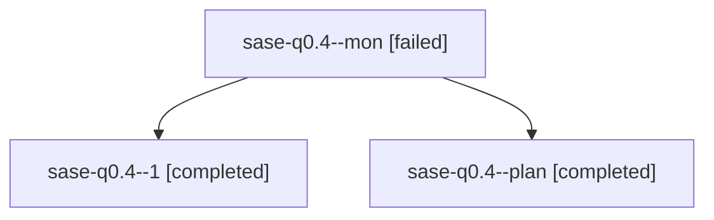

# Family: sase-q0.4

[Agent Hoods](../README.md) / [bbugyi200](../users/bbugyi200/README.md) / [athena](../users/bbugyi200/machines/athena/README.md) / [sase-q0](../users/bbugyi200/machines/athena/hoods/sase-q0/README.md) / sase-q0.4

Owner: `bbugyi200.athena` · Hood: `sase-q0` · Members: 3 · Bead: [sase-q0.4](https://github.com/sase-org/sase--beads/blob/main/pages/sase-q0/sase-q0.4.md)

## Lineage

The diagram is an optional enhancement; the ordered table below contains the same lineage in accessible text.

| Role | Agent | State | Model / provider | Timing | Commits | Prompt | Chat |
|---|---|---|---|---|---:|---|---|
| mon | sase-q0.4--mon | failed | grok-4.6 / grok | 2026-08-18T21:10:59.815544+00:00 | 0 | — | [Chat](../agents/bbugyi200.athena.sase-q0.4--mon/chat.md) |
| 1 | sase-q0.4--1 | completed | grok-4.6 / grok | 2026-08-18T21:11:59.890352+00:00 | [1](../agents/bbugyi200.athena.sase-q0.4--1/README.md#commits) | [Prompt](../agents/bbugyi200.athena.sase-q0.4--1/prompt.md) | [Chat](../agents/bbugyi200.athena.sase-q0.4--1/chat.md) |
| plan | sase-q0.4--plan | completed | grok-4.6 / grok | 2026-08-18T20:34:02.365196+00:00 | 0 | [Prompt](../agents/bbugyi200.athena.sase-q0.4--plan/prompt.md) | [Chat](../agents/bbugyi200.athena.sase-q0.4--plan/chat.md) |

## Commits

| Role | Repo | Commit | Subject | Committed |
|---|---|---|---|---|
| 1 | sase | [`716e9de`](https://github.com/sase-org/sase/commit/716e9de98f2f6346ef0ae23ba92be08f17397730) | feat(doctor): detect workspace occupancy conflicts | 2026-08-18 17:14:53 EDT |

## Neighbors

| Agent | Relation | State |
|---|---|---|
| [sase-q0.1](bbugyi200.athena.sase-q0.1.md) (family · 5) | sase-q0 hood | completed 3, failed 2 |
| [sase-q0.2](../agents/bbugyi200.athena.sase-q0.2/README.md) | sase-q0 hood | completed |
| [sase-q0.3](../agents/bbugyi200.athena.sase-q0.3/README.md) | sase-q0 hood | completed |
| [sase-q0.5.1](../agents/bbugyi200.athena.sase-q0.5.1/README.md) | sase-q0 hood | completed |
| [sase-q0.5.2](../agents/bbugyi200.athena.sase-q0.5.2/README.md) | sase-q0 hood | completed |
| [sase-q0.5.land](../agents/bbugyi200.athena.sase-q0.5.land/README.md) | sase-q0 hood | completed |
| [sase-q0.land](bbugyi200.athena.sase-q0.land.md) (family · 2) | sase-q0 hood | failed 2 |
