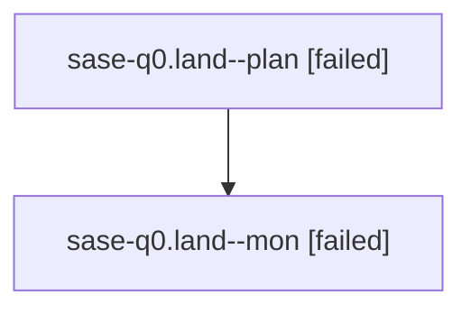

# Family: sase-q0.land

[Agent Hoods](../README.md) / [bbugyi200](../users/bbugyi200/README.md) / [athena](../users/bbugyi200/machines/athena/README.md) / [sase-q0](../users/bbugyi200/machines/athena/hoods/sase-q0/README.md) / sase-q0.land

Owner: `bbugyi200.athena` · Hood: `sase-q0` · Members: 2 · Bead: [sase-q0](https://github.com/sase-org/sase--beads/blob/main/pages/sase-q0/README.md)

## Lineage

The diagram is an optional enhancement; the ordered table below contains the same lineage in accessible text.

| Role | Agent | State | Model / provider | Timing | Commits | Prompt | Chat |
|---|---|---|---|---|---:|---|---|
| plan | sase-q0.land--plan | failed | opus / claude | 2026-08-18T21:16:44.041744+00:00 | 0 | [Prompt](../agents/bbugyi200.athena.sase-q0.land--plan/prompt.md) | [Chat](../agents/bbugyi200.athena.sase-q0.land--plan/chat.md) |
| mon | sase-q0.land--mon | failed | opus / claude | 2026-08-18T21:40:11.312309+00:00 | 0 | — | [Chat](../agents/bbugyi200.athena.sase-q0.land--mon/chat.md) |

## Neighbors

| Agent | Relation | State |
|---|---|---|
| [sase-q0.1](bbugyi200.athena.sase-q0.1.md) (family · 5) | sase-q0 hood | completed 3, failed 2 |
| [sase-q0.2](../agents/bbugyi200.athena.sase-q0.2/README.md) | sase-q0 hood | completed |
| [sase-q0.3](../agents/bbugyi200.athena.sase-q0.3/README.md) | sase-q0 hood | completed |
| [sase-q0.4](bbugyi200.athena.sase-q0.4.md) (family · 3) | sase-q0 hood | completed 2, failed 1 |
| [sase-q0.5.1](../agents/bbugyi200.athena.sase-q0.5.1/README.md) | sase-q0 hood | completed |
| [sase-q0.5.2](../agents/bbugyi200.athena.sase-q0.5.2/README.md) | sase-q0 hood | active |
| [sase-q0.5.land](../agents/bbugyi200.athena.sase-q0.5.land/README.md) | sase-q0 hood | waiting |
