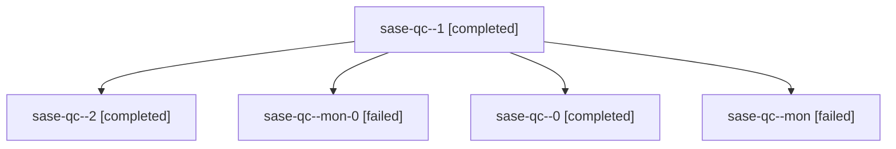

# Family: sase-qc

[Agent Hoods](../README.md) / [bbugyi200](../users/bbugyi200/README.md) / [athena](../users/bbugyi200/machines/athena/README.md) / [sase-qc](../users/bbugyi200/machines/athena/hoods/sase-qc/README.md) / sase-qc

Owner: `bbugyi200.athena` · Hood: `sase-qc` · Members: 5 · Bead: [sase-qc](https://github.com/sase-org/sase--beads/blob/main/pages/sase-qc/README.md)

## Lineage

The diagram is an optional enhancement; the ordered table below contains the same lineage in accessible text.

| Role | Agent | State | Model / provider | Timing | Commits | Prompt | Chat |
|---|---|---|---|---|---:|---|---|
| 1 | sase-qc--1 | completed | sonnet / claude | 2026-08-18T21:54:49.264032+00:00 | 0 | [Prompt](../agents/bbugyi200.athena.sase-qc--1/prompt.md) | [Chat](../agents/bbugyi200.athena.sase-qc--1/chat.md) |
| 2 | sase-qc--2 | completed | sonnet / claude | 2026-08-18T22:03:47.495834+00:00 | [1](../agents/bbugyi200.athena.sase-qc--2/README.md#commits) | [Prompt](../agents/bbugyi200.athena.sase-qc--2/prompt.md) | [Chat](../agents/bbugyi200.athena.sase-qc--2/chat.md) |
| mon-0 | sase-qc--mon-0 | failed | sonnet / claude | 2026-08-18T21:56:30.873159+00:00 | 0 | — | [Chat](../agents/bbugyi200.athena.sase-qc--mon-0/chat.md) |
| 0 | sase-qc--0 | completed | sonnet / claude | 2026-08-18T21:43:18.744838+00:00 | 0 | [Prompt](../agents/bbugyi200.athena.sase-qc--0/prompt.md) | [Chat](../agents/bbugyi200.athena.sase-qc--0/chat.md) |
| mon | sase-qc--mon | failed | sonnet / claude | 2026-08-18T21:52:33.372092+00:00 | 0 | — | [Chat](../agents/bbugyi200.athena.sase-qc--mon/chat.md) |

## Commits

| Role | Repo | Commit | Subject | Committed |
|---|---|---|---|---|
| 2 | sase | [`7563372`](https://github.com/sase-org/sase/commit/7563372f12e7c8b259dcd2bf9654a73d3a110c02) | fix(workspace): guard prepare\_opened\_checkout against occupied checkouts | 2026-08-18 18:05:01 EDT |
