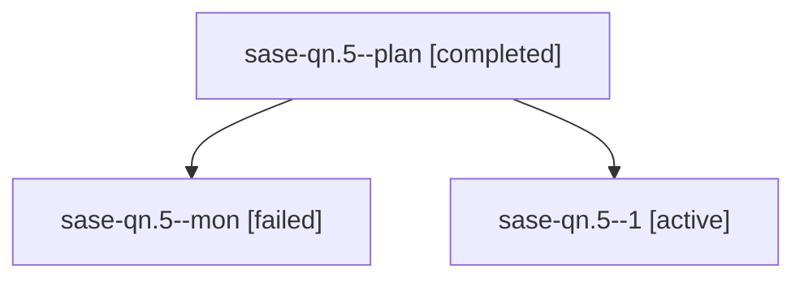

# Family: sase-qn.5

[Agent Hoods](../README.md) / [bbugyi200](../users/bbugyi200/README.md) / [athena](../users/bbugyi200/machines/athena/README.md) / [sase-qn](../users/bbugyi200/machines/athena/hoods/sase-qn/README.md) / sase-qn.5

Owner: `bbugyi200.athena` · Hood: `sase-qn` · Members: 3 · Bead: [sase-qn.5](https://github.com/sase-org/sase--beads/blob/main/pages/sase-qn/sase-qn.5.md)

## Lineage

The diagram is an optional enhancement; the ordered table below contains the same lineage in accessible text.

| Role | Agent | State | Model / provider | Timing | Commits | Prompt | Chat |
|---|---|---|---|---|---:|---|---|
| plan | sase-qn.5--plan | completed | grok-4.6 / grok | 2026-08-19T01:55:17.353969+00:00 | 0 | [Prompt](../agents/bbugyi200.athena.sase-qn.5--plan/prompt.md) | [Chat](../agents/bbugyi200.athena.sase-qn.5--plan/chat.md) |
| mon | sase-qn.5--mon | failed | grok-4.6 / grok | 2026-08-19T02:32:54.891854+00:00 | 0 | — | [Chat](../agents/bbugyi200.athena.sase-qn.5--mon/chat.md) |
| 1 | sase-qn.5--1 | active | grok-4.6 / grok | 2026-08-19T02:49:08.569714+00:00 | 0 | [Prompt](../agents/bbugyi200.athena.sase-qn.5--1/prompt.md) | — |

## Neighbors

| Agent | Relation | State |
|---|---|---|
| [sase-qn.1](../agents/bbugyi200.athena.sase-qn.1/README.md) | sase-qn hood | completed |
| [sase-qn.2](../agents/bbugyi200.athena.sase-qn.2/README.md) | sase-qn hood | completed |
| [sase-qn.3](../agents/bbugyi200.athena.sase-qn.3/README.md) | sase-qn hood | completed |
| [sase-qn.4](../agents/bbugyi200.athena.sase-qn.4/README.md) | sase-qn hood | completed |
| [sase-qn.land](../agents/bbugyi200.athena.sase-qn.land/README.md) | sase-qn hood | waiting |
