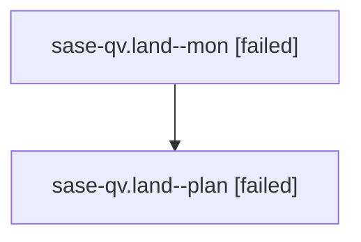

# Family: sase-qv.land

[Agent Hoods](../README.md) / [bbugyi200](../users/bbugyi200/README.md) / [athena](../users/bbugyi200/machines/athena/README.md) / [sase-qv](../users/bbugyi200/machines/athena/hoods/sase-qv/README.md) / sase-qv.land

Owner: `bbugyi200.athena` · Hood: `sase-qv` · Members: 2 · Bead: [sase-qv](https://github.com/sase-org/sase--beads/blob/main/pages/sase-qv/README.md)

## Lineage

The diagram is an optional enhancement; the ordered table below contains the same lineage in accessible text.

| Role | Agent | State | Model / provider | Timing | Commits | Prompt | Chat |
|---|---|---|---|---|---:|---|---|
| mon | sase-qv.land--mon | failed | grok-4.6 / grok | 2026-08-19T20:11:05.430660+00:00 | 0 | — | [Chat](../agents/bbugyi200.athena.sase-qv.land--mon/chat.md) |
| plan | sase-qv.land--plan | failed | grok-4.6 / grok | 2026-08-19T19:54:42.328247+00:00 | 0 | [Prompt](../agents/bbugyi200.athena.sase-qv.land--plan/prompt.md) | [Chat](../agents/bbugyi200.athena.sase-qv.land--plan/chat.md) |

## Neighbors

| Agent | Relation | State |
|---|---|---|
| [sase-qv.1](../agents/bbugyi200.athena.sase-qv.1/README.md) | sase-qv hood | completed |
| [sase-qv.2](../agents/bbugyi200.athena.sase-qv.2/README.md) | sase-qv hood | completed |
| [sase-qv.3](../agents/bbugyi200.athena.sase-qv.3/README.md) | sase-qv hood | completed |
| [sase-qv.4](../agents/bbugyi200.athena.sase-qv.4/README.md) | sase-qv hood | completed |
| [sase-qv.5](../agents/bbugyi200.athena.sase-qv.5/README.md) | sase-qv hood | completed |
| [sase-qv.6](../agents/bbugyi200.athena.sase-qv.6/README.md) | sase-qv hood | completed |
| [sase-qv.7](../agents/bbugyi200.athena.sase-qv.7/README.md) | sase-qv hood | completed |
| [sase-qv.8.1](../agents/bbugyi200.athena.sase-qv.8.1/README.md) | sase-qv hood | completed |
| [sase-qv.8.2](bbugyi200.athena.sase-qv.8.2.md) (family · 3) | sase-qv hood | completed 2, failed 1 |
| [sase-qv.8.land](../agents/bbugyi200.athena.sase-qv.8.land/README.md) | sase-qv hood | waiting |
