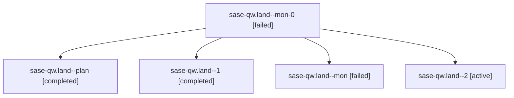

# Family: sase-qw.land

[Agent Hoods](../README.md) / [bbugyi200](../users/bbugyi200/README.md) / [athena](../users/bbugyi200/machines/athena/README.md) / [sase-qw](../users/bbugyi200/machines/athena/hoods/sase-qw/README.md) / sase-qw.land

Owner: `bbugyi200.athena` · Hood: `sase-qw` · Members: 5 · Bead: [sase-qw](https://github.com/sase-org/sase--beads/blob/main/pages/sase-qw/README.md)

## Lineage

The diagram is an optional enhancement; the ordered table below contains the same lineage in accessible text.

| Role | Agent | State | Model / provider | Timing | Commits | Prompt | Chat |
|---|---|---|---|---|---:|---|---|
| mon-0 | sase-qw.land--mon-0 | failed | opus / claude | 2026-08-19T18:26:30.280919+00:00 | 0 | — | [Chat](../agents/bbugyi200.athena.sase-qw.land--mon-0/chat.md) |
| plan | sase-qw.land--plan | completed | opus / claude | 2026-08-19T17:42:54.800482+00:00 | 0 | [Prompt](../agents/bbugyi200.athena.sase-qw.land--plan/prompt.md) | [Chat](../agents/bbugyi200.athena.sase-qw.land--plan/chat.md) |
| 1 | sase-qw.land--1 | completed | opus / claude | 2026-08-19T18:21:41.385412+00:00 | 0 | [Prompt](../agents/bbugyi200.athena.sase-qw.land--1/prompt.md) | [Chat](../agents/bbugyi200.athena.sase-qw.land--1/chat.md) |
| mon | sase-qw.land--mon | failed | opus / claude | 2026-08-19T17:53:42.354492+00:00 | 0 | — | [Chat](../agents/bbugyi200.athena.sase-qw.land--mon/chat.md) |
| 2 | sase-qw.land--2 | active | opus / claude | 2026-08-19T18:39:56.168291+00:00 | [1](../agents/bbugyi200.athena.sase-qw.land--2/README.md#commits) | [Prompt](../agents/bbugyi200.athena.sase-qw.land--2/prompt.md) | — |

## Commits

| Role | Repo | Commit | Subject | Committed |
|---|---|---|---|---|
| 2 | sase | [`4950f06`](https://github.com/sase-org/sase/commit/4950f060c8d2919ab9b21499adbba0e6e0570ea1) | test(tui): refresh footer and help goldens for the ,L leader row | 2026-08-19 18:46:59 UTC |

## Neighbors

| Agent | Relation | State |
|---|---|---|
| [sase-qw.1](../agents/bbugyi200.athena.sase-qw.1/README.md) | sase-qw hood | completed |
| [sase-qw.2](../agents/bbugyi200.athena.sase-qw.2/README.md) | sase-qw hood | completed |
| [sase-qw.3](../agents/bbugyi200.athena.sase-qw.3/README.md) | sase-qw hood | completed |
