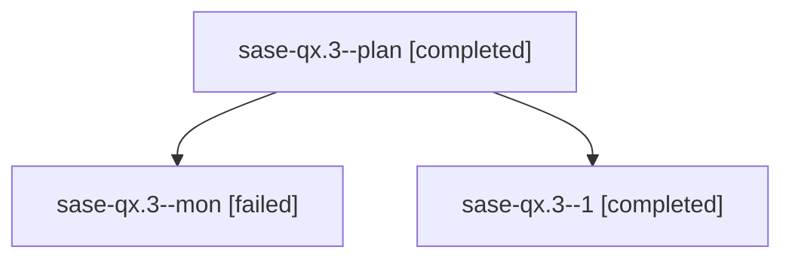

# Family: sase-qx.3

[Agent Hoods](../README.md) / [bbugyi200](../users/bbugyi200/README.md) / [athena](../users/bbugyi200/machines/athena/README.md) / [sase-qx](../users/bbugyi200/machines/athena/hoods/sase-qx/README.md) / sase-qx.3

Owner: `bbugyi200.athena` · Hood: `sase-qx` · Members: 3 · Bead: [sase-qx.3](https://github.com/sase-org/sase--beads/blob/main/pages/sase-qx/sase-qx.3.md)

## Lineage

The diagram is an optional enhancement; the ordered table below contains the same lineage in accessible text.

| Role | Agent | State | Model / provider | Timing | Commits | Prompt | Chat |
|---|---|---|---|---|---:|---|---|
| plan | sase-qx.3--plan | completed | grok-4.6 / grok | 2026-08-19T17:12:10.713576+00:00 | 0 | [Prompt](../agents/bbugyi200.athena.sase-qx.3--plan/prompt.md) | [Chat](../agents/bbugyi200.athena.sase-qx.3--plan/chat.md) |
| mon | sase-qx.3--mon | failed | grok-4.6 / grok | 2026-08-19T18:29:25.464733+00:00 | 0 | — | [Chat](../agents/bbugyi200.athena.sase-qx.3--mon/chat.md) |
| 1 | sase-qx.3--1 | completed | grok-4.6 / grok | 2026-08-19T18:42:54.607432+00:00 | [1](../agents/bbugyi200.athena.sase-qx.3--1/README.md#commits) | [Prompt](../agents/bbugyi200.athena.sase-qx.3--1/prompt.md) | [Chat](../agents/bbugyi200.athena.sase-qx.3--1/chat.md) |

## Commits

| Role | Repo | Commit | Subject | Committed |
|---|---|---|---|---|
| 1 | sase | [`c8a0e71`](https://github.com/sase-org/sase/commit/c8a0e7184a4eb0961fe75afe82ce90962e45eded) | feat(ace): add Launch Control soft-disable workflow | 2026-08-19 18:54:31 UTC |

## Neighbors

| Agent | Relation | State |
|---|---|---|
| [sase-qx.1](../agents/bbugyi200.athena.sase-qx.1/README.md) | sase-qx hood | completed |
| [sase-qx.2](../agents/bbugyi200.athena.sase-qx.2/README.md) | sase-qx hood | completed |
| [sase-qx.4](../agents/bbugyi200.athena.sase-qx.4/README.md) | sase-qx hood | completed |
| [sase-qx.5](../agents/bbugyi200.athena.sase-qx.5/README.md) | sase-qx hood | completed |
| [sase-qx.land](bbugyi200.athena.sase-qx.land.md) (family · 3) | sase-qx hood | dismissed 1, failed 2 |
| [sase-qx.land](../agents/bbugyi200.athena.sase-qx.land/README.md) | sase-qx hood | completed |
| [sase-qx.land\_2](../agents/bbugyi200.athena.sase-qx.land_2/README.md) | sase-qx hood | active |
