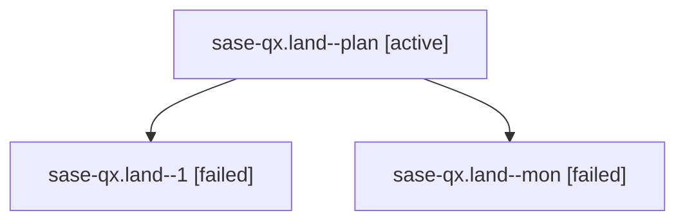

# Family: sase-qx.land

[Agent Hoods](../README.md) / [bbugyi200](../users/bbugyi200/README.md) / [athena](../users/bbugyi200/machines/athena/README.md) / [sase-qx](../users/bbugyi200/machines/athena/hoods/sase-qx/README.md) / sase-qx.land

Owner: `bbugyi200.athena` · Hood: `sase-qx` · Members: 3 · Bead: [sase-qx](https://github.com/sase-org/sase--beads/blob/main/pages/sase-qx/README.md)

## Lineage

The diagram is an optional enhancement; the ordered table below contains the same lineage in accessible text.

| Role | Agent | State | Model / provider | Timing | Commits | Prompt | Chat |
|---|---|---|---|---|---:|---|---|
| plan | sase-qx.land--plan | active | grok-4.6 / grok | 2026-08-19T20:24:12.887588+00:00 | [1](../agents/bbugyi200.athena.sase-qx.land--plan/README.md#commits) | [Prompt](../agents/bbugyi200.athena.sase-qx.land--plan/prompt.md) | [Chat](../agents/bbugyi200.athena.sase-qx.land--plan/chat.md) |
| 1 | sase-qx.land--1 | failed | grok-4.6 / grok | 2026-08-19T21:27:13.650333+00:00 | 0 | [Prompt](../agents/bbugyi200.athena.sase-qx.land--1/prompt.md) | — |
| mon | sase-qx.land--mon | failed | grok-4.6 / grok | 2026-08-19T20:51:35.296818+00:00 | 0 | — | [Chat](../agents/bbugyi200.athena.sase-qx.land--mon/chat.md) |

## Commits

| Role | Repo | Commit | Subject | Committed |
|---|---|---|---|---|
| plan | sase | [`4eb0c20`](https://github.com/sase-org/sase/commit/4eb0c20b31c3b9ecf149f5f061d9c37a1655b725) | fix(ace): distinguish hard and soft provider disables in tmux Agent | 2026-08-19 16:47:34 EDT |

## Neighbors

| Agent | Relation | State |
|---|---|---|
| [sase-qx.1](../agents/bbugyi200.athena.sase-qx.1/README.md) | sase-qx hood | active |
| [sase-qx.2](../agents/bbugyi200.athena.sase-qx.2/README.md) | sase-qx hood | active |
| [sase-qx.3](bbugyi200.athena.sase-qx.3.md) (family · 3) | sase-qx hood | active 3 |
| [sase-qx.4](../agents/bbugyi200.athena.sase-qx.4/README.md) | sase-qx hood | active |
| [sase-qx.5](../agents/bbugyi200.athena.sase-qx.5/README.md) | sase-qx hood | active |
| [sase-qx.land\_2](../agents/bbugyi200.athena.sase-qx.land_2/README.md) | sase-qx hood | active |
